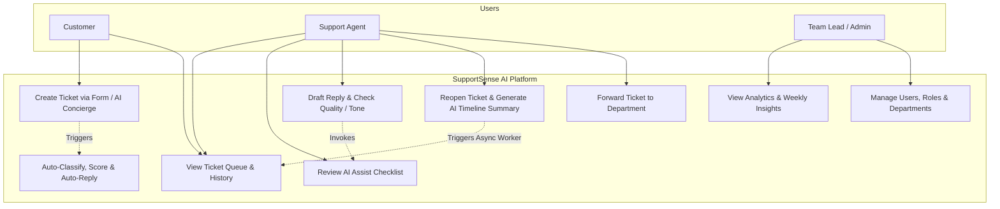

# Module 02: Functional & Non-Functional Requirements & Use Cases

---

## 4. Functional Requirements

### 4.1 Ticket & Workspace Management (FR-100 series)
- **FR-101 (Ticket Creation & Ingestion)**: Customers/Agents can submit new support tickets via standard form or through the AI Concierge Chatbot.
- **FR-102 (Lifecycle State Engine & Status Transitions)**: System must enforce strict status transitions (`ALLOWED_STATUS_TRANSITIONS`): `OPEN` ➔ `IN_PROGRESS` ➔ `RESOLVED` ➔ `CLOSED`. Reopening is permitted only from `RESOLVED` to `OPEN`. Attempts to make invalid transitions return HTTP 400.
- **FR-103 (Threaded Messaging)**: Messages within a ticket thread support customer replies, agent public responses, and internal agent-only notes (customers are restricted from viewing or posting internal notes).
- **FR-104 (Agent Assignment & Forwarding)**: Agents/Admins can reassign tickets or forward tickets between departments (`Finance & Billing`, `Technical Support`, `Identity & Access`, `API Platform Team`) with internal handover notes.
- **FR-105 (Atomic Transactional Ticket Creation - SCRUM-112)**: System must create the ticket record and its initial customer message within a single atomic PostgreSQL transaction (`BEGIN` / `COMMIT` / `ROLLBACK`). If initial message creation fails, the ticket is rolled back completely.
- **FR-106 (Database Concurrency & Pooling - SCRUM-110)**: Backend must handle burst submissions using PostgreSQL connection pooling and the `ticket_number_seq` sequence to guarantee non-colliding human-readable ticket numbers (`T-1001`, `T-1002`, ...).
- **FR-107 (Duplicate Resolved Ticket Interception - SSAI-409)**: Before creating a new ticket, system inspects the customer's previous tickets for matching resolved/closed issues. If found and `forceCreate` is false, returns `HTTP 409 DUPLICATE_RESOLVED_TICKET` with past resolution notes, offering the user a choice to view the resolved ticket or submit anyway.
- **FR-108 (Same-User Ticket Linking & Follow-Up Detection - SSAI-409)**: Detects when a customer submits an inquiry following up on an active ticket (`linked_ticket_id`). Links the message directly to the existing ticket thread to prevent queue fragmentation.
- **FR-109 (Multi-Department Agent Routing & Assignment)**: Organizes agents and tickets into 4 core departments: `Technical Support`, `Finance & Billing`, `Identity & Access`, and `API Platform`, storing the department in `users.department`.

### 4.2 AI Intelligence & Decision Support (FR-200 series)
- **FR-201 (AI Classification & Priority)**: System calls the AI service upon ticket creation to automatically tag category (`Billing`, `Technical`, `Account`, `Bug`, `General`) and priority (`LOW`, `MEDIUM`, `HIGH`, `URGENT`) with confidence ratings.
- **FR-202 (AI Mood & Patience Score)**: AI evaluates customer emotion in real time (`🙂 HAPPY`, `😐 NEUTRAL`, `😠 FRUSTRATED`) and patience score (`CALM`, `CONCERNED`, `FRUSTRATED`, `CRITICAL`) with numerical confidence metrics.
- **FR-203 (Resolution Time Predictor)**: AI analyzes issue complexity and historical benchmarks from Kaggle/HuggingFace datasets to predict resolution duration (e.g., *"1–2 business days"*).
- **FR-204 (Agent Assist Checklist)**: AI generates 3–5 actionable verification checkboxes tailored to the ticket content (persisted in `agent_checklists` and toggleable in UI).
- **FR-205 (Response Quality Checker)**: Agents can evaluate proposed draft replies across 4 key pillars: Professionalism, Empathy, Clarity, and Actionability (0–100 scales) with instant improvement suggestions.
- **FR-206 (Reopened Ticket Timeline Summary - SCRUM-113)**: When a ticket is reopened (`RESOLVED` ➔ `OPEN`), an asynchronous fire-and-forget worker queries the AI service to condense the entire message history into a 5-6 bullet executive summary and persists it to `ai_metadata.timeline_summary`.
- **FR-207 (AI Concierge Chatbot & Ticket Crafter)**: Conversational assistant widget where users describe issues in simple language; the AI converses empathetically, diagnoses initial obstacles, and synthesizes a formal enterprise ticket specification ready for 1-click dispatch.
- **FR-208 (1-Click AI Response Tone Polishing with 3-Variation Cycling)**: Agents can rewrite draft responses into specialized styles: `Empathetic`, `Concise`, `Formal`, or `Technical`. Supports cycling through 3 distinct variations (`v1`, `v2`, `v3`) with strict anti-nesting rules stripping duplicate greetings.
- **FR-209 (Department Automated Responses)**: AI evaluates incoming tickets against department rules and dispatches immediate confirmations with automated diagnostics if confidence meets the department threshold (80%–90%).
- **FR-210 (Weekly Learning Insights)**: AI aggregates closed ticket data weekly to compute top recurring customer pain points, common agent handling errors, and recommended Knowledge Base additions.
- **FR-211 (Real-Time Knowledge Base FAQ Integration & Deflection - SSAI-410)**: Backend exposes `/api/v1/ai/faqs` and `/api/v1/ai/faqs/search`. Frontend dynamically matches FAQs against customer input in forms and concierge chat, offering 1-click deflection.
- **FR-212 (Anti-Gaming Urgency & Mood Decoupling)**: System prompts explicitly decouple customer emotional state / shouting from technical priority. Shouting "URGENT" or "EMERGENCY" without verified business impact does not raise technical priority.

### 4.3 Administration & Analytics (FR-300 series)
- **FR-301 (Role-Based Access Control & Personas)**: Three distinct roles: `CUSTOMER`, `AGENT`, `ADMIN` with 9 pre-seeded multi-department testing personas. Public registration strictly enforces `CUSTOMER` role.
- **FR-302 (Analytics & SLA Dashboard)**: Real-time graphs and metrics showing ticket volume, resolution times, average CSAT, SLA breach risks, and customer mood distributions.
- **FR-303 (Department Rules & Policies View)**: Dedicated interface displaying supported departments, categories, target SLAs, and active auto-reply templates.

---

## 5. Non-Functional Requirements

### 5.1 Performance & Scalability (NFR-100)
- **NFR-101 (API Response Time)**: Backend REST endpoints respond in ≤ 200ms for 95% of standard requests.
- **NFR-102 (AI Latency & Concurrency)**: AI microservice leverages model instance pooling (`_MODEL_CACHE`) and in-memory TTL caching (`_RESPONSE_CACHE`) to provide sub-millisecond cached responses and < 1.5s live generation.
- **NFR-103 (Database Efficiency)**: Queries on ticket queues utilize compound indexes (`idx_tickets_status_priority`, `idx_tickets_customer_id`, etc.) and execute in ≤ 50ms.

### 5.2 Security & Compliance (NFR-200)
- **NFR-201 (Authentication & RBAC)**: Secure JWT Bearer tokens with 1-hour expiration. Passwords hashed using bcrypt (10 rounds).
- **NFR-202 (Anti-Privilege Escalation)**: Public registration endpoint sanitizes input roles to prevent unauthorized elevation to `AGENT` or `ADMIN`.
- **NFR-203 (CORS Origin Whitelisting)**: Express and FastAPI enforce explicit origin whitelisting (`ALLOWED_ORIGINS`).

### 5.3 Reliability & Availability (NFR-300)
- **NFR-301 (Graceful Degradation & HITL Fallback)**: If Gemini API fails or times out (5-second timeout via `AbortSignal.timeout(5000)`), the system seamlessly returns safe fallback payloads without interrupting ticket workflows.
- **NFR-302 (Zero Downtime Standalone UI)**: Frontend incorporates local mock fallback data (`api.js`) for seamless offline demonstrations and developer workflows.

### 5.4 Usability & Accessibility (NFR-400)
- **NFR-401 (WCAG 2.1 AA Compliance)**: Minimum 4.5:1 color contrast ratio across Light and Dark themes, keyboard navigation, and ARIA labels.
- **NFR-402 (MoonRow Enterprise Design System)**: Cohesive typography, dark/light theme persistence, responsive mobile to 4K displays.

---

## 13. Use Case Diagram

---

## 14. Use Case Descriptions

### UC-01: Auto-Classify and Assist Ticket Processing
- **Primary Actor**: Support Agent / System Backend
- **Pre-conditions**: Customer submits a new ticket.
- **Main Success Scenario**:
  1. System creates ticket and initial customer message atomically (`createTicketWithInitialMessage`).
  2. Backend asynchronously requests AI triage from Python FastAPI microservice.
  3. AI microservice queries Gemini API with `TRIAGE_AND_CATEGORIZATION_ROLE_PROMPT` grounded in dataset benchmarks.
  4. AI returns JSON containing category, priority, customer mood (`😠 FRUSTRATED`), patience score (`CONCERNED`), predicted resolution (`1-2 business days`), and checklist items.
  5. System evaluates department auto-reply; if eligible, posts automated confirmation message to the thread.
  6. Support Agent opens ticket, viewing pre-classified priority, mood badge, and actionable checkboxes.
- **Alternative Flow**:
  - *Gemini API Timeout/Error*: System returns graceful fallback metadata (Category `General`, Priority `MEDIUM`, Confidence `0.50`), allowing human agents to triage manually without failure.

### UC-02: AI Pre-Send Response Quality Verification
- **Primary Actor**: Support Agent
- **Pre-conditions**: Agent opens an active ticket and writes a draft response.
- **Main Success Scenario**:
  1. Agent clicks **"Verify Response Quality"**.
  2. Frontend sends customer original issue + agent draft to `/api/v1/ai/verify-response`.
  3. AI microservice scores draft on 4 axes: Professionalism, Empathy, Clarity, Actionability (0–100).
  4. AI provides specific improvement suggestions.
  5. Agent clicks "Apply Suggestion" or manually refines draft before dispatch.

### UC-03: AI Concierge Conversational Intake & Ticket Creation
- **Primary Actor**: Customer or Agent
- **Pre-conditions**: User opens the SupportSense AI Concierge widget.
- **Main Success Scenario**:
  1. User describes issue in simple, conversational words (e.g. *"I was charged twice on my credit card yesterday"*).
  2. AI Concierge engages empathetically, provides preliminary diagnostic feedback, and asks quick clarifying questions.
  3. AI Concierge crafts a formal enterprise ticket specification containing Executive Summary, Symptoms, Business Impact, and Diagnostic Checklist.
  4. User clicks **"Dispatch Ticket"** to submit the ticket atomically into the system.

### UC-04: 1-Click AI Response Tone Polishing
- **Primary Actor**: Support Agent
- **Pre-conditions**: Agent types an informal or rough draft response in the ticket reply box.
- **Main Success Scenario**:
  1. Agent clicks **"Polish Tone"** and selects a style (`Empathetic`, `Concise`, `Formal`, or `Technical`).
  2. System calls `/api/v1/ai/polish-tone` with draft text and desired tone.
  3. AI rewrites the message while preserving facts and provides a rationale.
  4. Agent reviews the polished text and clicks **"Apply to Reply"**.

### UC-05: Reopened Ticket Timeline Summary Generation
- **Primary Actor**: Support Agent / Backend Worker
- **Pre-conditions**: Ticket is currently in `RESOLVED` status.
- **Main Success Scenario**:
  1. Agent updates ticket status to `OPEN` (e.g. customer indicates issue recurred).
  2. Backend validates status transition and returns HTTP 200 immediately.
  3. Fire-and-forget worker calls `/api/v1/ai/summarize-timeline` with full thread history.
  4. AI microservice condenses thread into 5-6 chronological bullets and upserts into `ai_metadata`.
  5. Next ticket detail view displays the prominent `TimelineSummaryBanner` at the top of the workbench.

### UC-06: Duplicate Resolved Ticket Interception & Customer Override
- **Primary Actor**: Customer / System Backend
- **Pre-conditions**: Customer has previously submitted and resolved an identical/similar issue.
- **Main Success Scenario**:
  1. Customer fills in ticket creation form or sends message to AI Concierge.
  2. Backend scans customer's past resolved tickets via `findDuplicateOrRelatedTickets`.
  3. Backend detects high-similarity match and returns `HTTP 409 DUPLICATE_RESOLVED_TICKET` with past ticket number, title, and resolution notes.
  4. UI renders a warning card presenting previous resolution steps and two actions:
     - **"View Resolved Ticket"**: Navigates directly to the resolved ticket.
     - **"Issue Still Persists (Submit Anyway)"**: Dispatches ticket creation with `forceCreate: true`, creating a new ticket with link reference.

### UC-07: Real-Time Knowledge Base FAQ Deflection
- **Primary Actor**: Customer
- **Pre-conditions**: Customer enters text into ticket title, description, or AI Concierge prompt.
- **Main Success Scenario**:
  1. Frontend debounces text input and calls `/api/v1/ai/faqs/search?q=...`.
  2. System returns top matching verified FAQ articles with solutions.
  3. Customer expands the FAQ answer card and resolves their question immediately.
  4. Customer clicks **"✅ Solved My Issue"**, deflecting ticket submission and preventing ticket queue inflation.

### UC-08: Follow-up Ticket Linking for Same User
- **Primary Actor**: Customer / System Backend
- **Pre-conditions**: Customer already has an active ticket (`OPEN` or `IN_PROGRESS`).
- **Main Success Scenario**:
  1. Customer submits a new message asking for an update or additional detail on their issue.
  2. Backend identifies existing active ticket under same category or detects follow-up intent keywords.
  3. Backend links the inquiry by either appending the message directly to the existing thread or setting `linked_ticket_id` on the new ticket record.
  4. Agent workbench renders the **"🔗 Linked & Related Inquiries"** card linking all related inquiries together.
