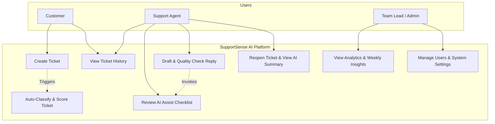

# Module 02: Functional & Non-Functional Requirements & Use Cases

---

## 4. Functional Requirements

### 4.1 Ticket & Workspace Management (FR-100 series)
- **FR-101 (Ticket Creation)**: Customers/Agents can submit new support tickets with Title, Description, Category, Product Area, and optional attachment metadata.
- **FR-102 (Lifecycle State Engine)**: System must enforce valid ticket status transitions: `Open` -> `In Progress` -> `Pending Customer` -> `Resolved` -> `Closed` (or `Reopened`).
- **FR-103 (Threaded Messaging)**: Messages within a ticket thread must support customer replies, agent public responses, and internal agent-only notes.
- **FR-104 (Agent Assignment)**: Team leads can assign tickets manually or agents can self-assign unassigned tickets.

### 4.2 AI Intelligence & Decision Support (FR-200 series)
- **FR-201 (AI Classification & Priority)**: System calls AI service upon ticket creation to automatically tag category (Billing, Technical, Account, Feature Request, Bug) and priority level (Low, Medium, High, Urgent) with confidence scores.
- **FR-202 (AI Mood & Patience Score)**: AI evaluates customer sentiment and updates mood (`🙂 Happy`, `😐 Neutral`, `😠 Frustrated`) and patience score (`Calm`, `Concerned`, `Frustrated`, `Critical`).
- **FR-203 (Resolution Time Predictor)**: AI analyzes issue complexity and historical data to output estimated resolution duration (e.g., "2–3 business days").
- **FR-204 (Agent Assist Checklist)**: AI generates 3–5 actionable verification checkboxes tailored to ticket content (e.g. `[ ] Check payment gateway logs`, `[ ] Verify user subscription status`).
- **FR-205 (Response Quality Checker)**: Before posting a draft reply, agent can click "Check Response Quality". AI scores tone on Professionalism, Empathy, Clarity, Actionability, and suggests enhancements.
- **FR-206 (Ticket Timeline Summary)**: When a ticket is reopened or reassigned, AI builds a concise 5–6 bullet timeline summary of key conversation milestones.
- **FR-207 (Duplicate & Related Ticket Detection)**: AI computes semantic similarity across past tickets to flag potential duplicates and surface related historical solutions.
- **FR-208 (Weekly Learning Insights)**: AI aggregates closed ticket data weekly to compute top 5 recurring customer pain points, common agent handling errors, and recommended Knowledge Base additions.

### 4.3 Administration & Analytics (FR-300 series)
- **FR-301 (Role-Based Access Control)**: Three distinct roles: `Customer`, `Agent`, `Admin`.
- **FR-302 (Analytics Dashboard)**: Real-time graphs showing ticket volume, resolution times, average CSAT, SLA breach rates, and mood distribution.

---

## 5. Non-Functional Requirements

### 5.1 Performance & Scalability (NFR-100)
- **NFR-101 (API Response Time)**: Backend REST endpoints must respond in ≤ 200ms for 95% of standard requests.
- **NFR-102 (AI Latency)**: AI microservice responses (including Gemini API calls) must complete within 2.5 seconds.
- **NFR-103 (Database Efficiency)**: Queries on ticket queues must utilize compound indexes and execute in ≤ 50ms.

### 5.2 Security & Compliance (NFR-200)
- **NFR-201 (Authentication)**: Secure JWT sign-in with HTTP-only cookies or Bearer tokens. Passwords hashed using `bcrypt` (10 rounds).
- **NFR-202 (Input Validation)**: All client input validated using schema validators (e.g. `Joi` or `Zod` on backend, Pydantic on AI service).
- **NFR-203 (Sanitization)**: HTML/XSS sanitization on all ticket descriptions and response bodies.

### 5.3 Reliability & Availability (NFR-300)
- **NFR-301 (Graceful Degradation)**: If Gemini API fails or times out, system must seamlessly fallback to manual ticket routing without crashing ticket submission.
- **NFR-302 (Uptime Goal)**: System designed for 99.9% operational availability.

### 5.4 Usability & Accessibility (NFR-400)
- **NFR-401 (WCAG 2.1 AA Compliance)**: Minimum 4.5:1 color contrast ratio across Light and Dark themes. Keyboard navigability for all ticket actions.
- **NFR-402 (Responsive Design)**: Dynamic layout responsive from mobile screen (360px) to ultra-wide (1920px+).

---

## 13. Use Case Diagram

---

## 14. Use Case Descriptions

### UC-01: Auto-Classify and Assist Ticket Processing
- **Primary Actor**: Support Agent / System Backend
- **Pre-conditions**: Customer submits a new ticket.
- **Main Success Scenario**:
  1. System receives raw ticket payload (Title & Description).
  2. Backend routes payload to Python FastAPI AI microservice.
  3. AI microservice queries Gemini API with structured prompt.
  4. AI returns JSON containing category, priority, mood (`😠 Frustrated`), patience score (`Concerned`), predicted resolution (`2-3 days`), and checklist items.
  5. Backend updates ticket record with AI metadata and confidence score (`0.92`).
  6. Support Agent opens ticket, sees pre-classified priority, mood indicator, and actionable checkboxes.
- **Alternative Flow**:
  - *Gemini API Timeout/Error*: System logs error, assigns default category `Unassigned`, priority `Medium`, confidence `0.00`, and notifies agent to manually review.

### UC-02: AI Pre-Send Response Quality Verification
- **Primary Actor**: Support Agent
- **Pre-conditions**: Agent opens an active ticket and writes a draft response.
- **Main Success Scenario**:
  1. Agent clicks **"Verify Response Quality"**.
  2. Frontend sends customer original issue + agent draft to `/api/v1/ai/verify-response`.
  3. AI microservice scores draft on 4 axes: Professionalism (85%), Empathy (90%), Clarity (95%), Actionability (80%).
  4. AI provides 1-sentence suggestion: *"Consider acknowledging the billing delay before asking for transaction ID."*
  5. Agent accepts suggested improvement, adjusts draft, and sends response.
