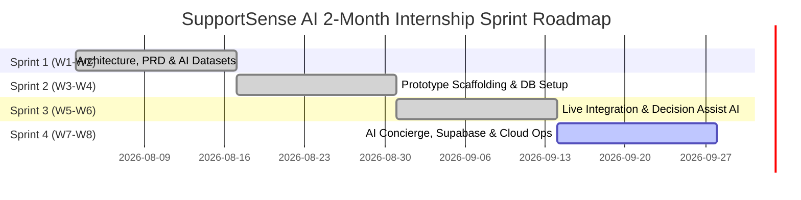

# Module 03: Agile Sprint Planning & Jira Backlog

---

> **Detailed Guide Available**: For the comprehensive, plain-English breakdown of story points, Fibonacci scale definitions, and team workload balance across all 29 tasks, please see [JIRA_STORY_POINT_BREAKDOWN_GUIDE.md](./JIRA_STORY_POINT_BREAKDOWN_GUIDE.md).

---

## 6. User Stories & Story Points

| ID | As a... | I want to... | So that... | Story Points |
|---|---|---|---|:---:|
| **US-01** | Support Agent | see customer mood (`🙂/😐/😠`) and a numerical patience score | I can prioritize urgent customer complaints and adapt my tone immediately | 5 |
| **US-02** | Support Agent | get an AI-generated step-by-step checklist for each ticket | I know the exact verification steps to resolve issues without missing procedures | 5 |
| **US-03** | Support Agent | check my response quality and tone before hitting send | I ensure my communication is empathetic, clear, actionable, and professional | 8 |
| **US-04** | Support Agent | see an AI summary banner when a ticket is reopened | I don't have to read 20 past messages to catch up on conversation history | 5 |
| **US-05** | Team Lead | view predicted ticket resolution times and category breakdowns | I can set realistic customer expectations and manage team capacity effectively | 5 |
| **US-06** | Knowledge Manager | view weekly AI Learning Insights and recurring failure patterns | I can update FAQ documentation and help articles based on top customer questions | 8 |
| **US-07** | Support Agent | polish my response tone with 1 click into 4 styles | I can tailor communication into Empathetic, Concise, Formal, or Technical style | 5 |
| **US-08** | Customer | describe issues conversationally with an AI Concierge | I get instant diagnostics and can turn my casual words into a formal ticket | 8 |
| **US-09** | Customer | receive instant departmental confirmation auto-replies | I know my ticket has been received and initial diagnostics have begun | 5 |
| **US-10** | System Administrator | manage agent roles, test logins, and system configuration | I maintain secure, role-based access across the customer support platform | 3 |
| **US-11** | Backend Lead | ensure ticket and initial message creation happens in one atomic transaction | database consistency is guaranteed and orphaned records are prevented | 5 |
| **US-12** | Backend Lead | enforce valid ticket status transitions via a strict state machine | tickets cannot skip required stages or transition out of terminal states | 5 |
| **US-13** | Database Lead | migrate database to Supabase Cloud with connection pooling | queries remain fast, reliable, and secure across global cloud infrastructure | 5 |

---

## 7. Product Backlog (31 Tasks across 6 Epics)

The product backlog consists of **31 tasks** totaling **166 story points**, distributed across 6 Epics:

> **Zero Backlog Guarantee**: Every single task is assigned directly to its respective Sprint (Sprint 1, 2, 3, or 4). There are **0 unassigned issues in the backlog**, ensuring Jira Sprint Burndown charts and velocity metrics reflect 100% of planned and delivered work.
> **Task Priority**: All tasks across Sprints 1 to 4 are standardized to **Medium Priority**, ensuring steady delivery focus while story points represent relative complexity.

```
[EPIC-1: Research & Requirements Specification] (18 pts)
  ├── SSAI-101: Research How Customer Support Tools Work & Compare Features (Priority: Medium | Est: 3 pts | Assignee: Rohan)
  ├── SSAI-102: Choose Right AI Model & Collect Real Customer Chat Datasets (Priority: Medium | Est: 5 pts | Assignee: Yash)
  ├── SSAI-103: Design Simple 3-Tier System Architecture & Database Tables (Priority: Medium | Est: 5 pts | Assignee: Shrujan)
  └── SSAI-104: Write Plain-English Project Requirements & 4-Sprint Schedule (Priority: Medium | Est: 5 pts | Assignee: Aarti)

[EPIC-2: UI/UX Design System & Frontend SPA] (38 pts)
  ├── SSAI-201: Build Website Frame with Dark & Light Mode Switcher (Priority: Medium | Est: 5 pts | Assignee: Rohan)
  ├── SSAI-202: Build Reusable UI Buttons, Cards & Offline Mock Data (Priority: Medium | Est: 5 pts | Assignee: Rohan)
  ├── SSAI-203: Create User Login Page with 1-Click Persona Testing Buttons (Priority: Medium | Est: 5 pts | Assignee: Yash)
  ├── SSAI-204: Build Ticket Workspace with Chat Thread & Live AI Helper Drawer (Priority: Medium | Est: 8 pts | Assignee: Yash)
  ├── SSAI-301: Connect All Website Screens to the Real Live Backend Server (Priority: Medium | Est: 5 pts | Assignee: Rohan)
  ├── SSAI-407: Build 1-Click AI Response Tone Polisher for Support Agents (Priority: Medium | Est: 5 pts | Assignee: Rohan)
  └── SSAI-410: Real-Time Knowledge Base FAQ Integration & Ticket Deflection (Priority: Medium | Est: 5 pts | Assignee: Rohan)

[EPIC-3: Core Backend Architecture & Database Engine] (35 pts)
  ├── SSAI-206: Set Up Express Backend Server, Security Headers & Rate Limiter (Priority: Medium | Est: 5 pts | Assignee: Shrujan)
  ├── SSAI-207: Create PostgreSQL Database Tables & Starter Test Data (Priority: Medium | Est: 5 pts | Assignee: Shrujan)
  ├── SSAI-208: Build Secure User Registration, Password Encryption & Login Tokens (Priority: Medium | Est: 5 pts | Assignee: Aarti)
  ├── SSAI-209: Build Ticket Management APIs & Connect to AI Microservice (Priority: Medium | Est: 8 pts | Assignee: Aarti)
  ├── SSAI-305: Enforce Strict Ticket Status Rules & Concurrency Testing (Priority: Medium | Est: 5 pts | Assignee: Shrujan)
  ├── SSAI-408: Migrate Database from Render to Supabase Cloud with Pooling (Priority: Medium | Est: 5 pts | Assignee: Shrujan)
  └── SSAI-409: Prevent Duplicate Resolved Tickets & Enable Follow-up Linking (Priority: Medium | Est: 5 pts | Assignee: Shrujan)

[EPIC-4: AI/LLM Microservice & Gemini Decision Support] (37 pts)
  ├── SSAI-205: Set Up Python AI Microservice with Google Gemini & Caching (Priority: Medium | Est: 8 pts | Assignee: Yash)
  ├── SSAI-302: Connect Real Google Gemini AI for Smart Ticket Triage & Mood Detection (Priority: Medium | Est: 8 pts | Assignee: Yash)
  ├── SSAI-303: Generate AI Action Checklists & Allow Agents to Check Off Items (Priority: Medium | Est: 5 pts | Assignee: Yash)
  ├── SSAI-304: Build Pre-Send AI Tone & Quality Checker for Support Replies (Priority: Medium | Est: 5 pts | Assignee: Rohan)
  ├── SSAI-306: Build AI Summary Banner for Reopened Support Tickets (Priority: Medium | Est: 5 pts | Assignee: Aarti)
  └── SSAI-406: Build AI Concierge Chatbot to Turn Simple Words into Formal Tickets (Priority: Medium | Est: 8 pts | Assignee: Yash)

[EPIC-5: Testing, Quality Assurance & Security Validation] (16 pts)
  ├── SSAI-307: Build Automated Department Routing & Instant Auto-Replies (Priority: Medium | Est: 5 pts | Assignee: Aarti)
  ├── SSAI-401: Test Website Accessibility, Colors & Responsive Layouts (Priority: Medium | Est: 5 pts | Assignee: Rohan)
  ├── SSAI-402: Test AI Accuracy with 100 Support Records & Benchmark Speed (Priority: Medium | Est: 5 pts | Assignee: Yash)
  └── SSAI-404: Security Check: Protect Private Notes & Block Malicious Input (Priority: Medium | Est: 3 pts | Assignee: Aarti)

[EPIC-6: DevOps, Cloud Deployment & Technical Documentation] (22 pts)
  ├── SSAI-210: Set Up Docker Containers & Complete Technical Documentation (Priority: Medium | Est: 5 pts | Assignee: Aarti)
  ├── SSAI-403: Add Database Speed Indexes & Run Backend Test Suite (Priority: Medium | Est: 5 pts | Assignee: Shrujan)
  └── SSAI-405: Deploy Full Project to Render Cloud Platform with HTTPS (Priority: Medium | Est: 5 pts | Assignee: Aarti)
```

---

## 8. Sprint Backlog Distribution

- **Sprint 1 (Research, Learning & Planning)**: 4 tasks, **18 Story Points** [Status: Closed]
  - Tasks: `SSAI-101`, `SSAI-102`, `SSAI-103`, `SSAI-104`
  - Burndown: 18 pts burned to 0 pts (Completed on Aug 16, 2026).
  - Team Focus: Domain research, Gemini speed tests, 3-tier architecture design, and sprint roadmap.
- **Sprint 2 (Prototype Build & Architecture)**: 10 tasks, **59 Story Points** [Status: Closed | Aug 17 – Aug 30, 2026]
  - Tasks: `SSAI-201`, `SSAI-202`, `SSAI-203`, `SSAI-204`, `SSAI-205`, `SSAI-206`, `SSAI-207`, `SSAI-208`, `SSAI-209`, `SSAI-210`
  - Burndown: 59 pts burned to 0 pts (Completed on Aug 30, 2026).
  - Team Focus: Scaffolding frontend UI, Express backend, JWT auth, PostgreSQL tables, FastAPI service, and Docker compose.
- **Sprint 3 (AI & Integration)**: 7 tasks, **38 Story Points** [Status: Active]
  - Tasks: `SSAI-301`, `SSAI-302`, `SSAI-303`, `SSAI-304`, `SSAI-305`, `SSAI-306`, `SSAI-307`
  - Team Focus: Live REST integration, Gemini triage & mood detection, interactive checklists, tone checker, status machine, and reopened banner.
- **Sprint 4 (Advanced AI, Cloud Migration & Hardening)**: 10 tasks, **51 Story Points** [Status: Future/In-Progress]
  - Tasks: `SSAI-401`, `SSAI-402`, `SSAI-403`, `SSAI-404`, `SSAI-405`, `SSAI-406`, `SSAI-407`, `SSAI-408`, `SSAI-409`, `SSAI-410`
  - Team Focus: AI Concierge chatbot, 1-click tone polisher, Supabase cloud database migration, duplicate prevention & linking, FAQ deflection, and Render deployment.

---

## 9. Agile Sprint Plan (4 Sprints / 8 Weeks)



### Sprint Velocity Summary
- **Sprint 1**: 18 Points
- **Sprint 2**: 59 Points
- **Sprint 3**: 38 Points
- **Sprint 4**: 41 Points
- **Total Project Velocity**: **156 Points** (Average: ~39 points per 2-week sprint)

---

## 10. Jira Epic List

1. **EPIC-1**: Research & Requirements Specification (`SSAI-EPIC-1`) — Lead: *Rohan Salkar*
2. **EPIC-2**: UI/UX Design System & Frontend SPA (`SSAI-EPIC-2`) — Lead: *Rohan Salkar*
3. **EPIC-3**: Core Backend Architecture & Database Engine (`SSAI-EPIC-3`) — Lead: *Shrujan Mitbavkar*
4. **EPIC-4**: AI/LLM Microservice & Gemini Decision Support (`SSAI-EPIC-4`) — Lead: *Yash Sanikop*
5. **EPIC-5**: Testing, Quality Assurance & Security Validation (`SSAI-EPIC-5`) — Lead: *Aarti Singh*
6. **EPIC-6**: DevOps, Cloud Deployment & Technical Documentation (`SSAI-EPIC-6`) — Lead: *Aarti Singh*

---

## 11. Jira User Stories & Task Breakdown Examples

### Task Example: `SSAI-305` (Strict Ticket Status Rules & Concurrency Testing)
- **Summary**: Enforce Strict Ticket Status Rules and Concurrency Testing
- **Issue Type**: Task
- **Epic**: EPIC-3 (Core Backend Architecture & Database Engine)
- **Assignee**: Shrujan Mitbavkar (Backend Lead)
- **Story Points**: 5 Points (Medium-High Complexity)
- **Description**: Make sure tickets follow strict state progression (`OPEN` ➔ `IN_PROGRESS` ➔ `RESOLVED` ➔ `CLOSED` or `OPEN`). Block invalid jumps (like jumping from `OPEN` directly to `RESOLVED`). Also verify database connection pooling handles simultaneous requests without crashing.

### Task Example: `SSAI-306` (AI Summary Banner for Reopened Tickets)
- **Summary**: Build AI Summary Banner for Reopened Support Tickets
- **Issue Type**: Task
- **Epic**: EPIC-4 (AI/LLM Microservice & Gemini Decision Support)
- **Assignee**: Aarti Singh (DevOps & QA Lead)
- **Story Points**: 5 Points (Medium-High Complexity)
- **Description**: When a previously solved ticket is reopened by a customer, automatically summarize past conversation history into 5-6 clear bullet points using Gemini, and show this summary in a yellow highlight banner at the top of the ticket.

### Task Example: `SSAI-406` (AI Concierge Chatbot)
- **Summary**: Build AI Concierge Chatbot to Turn Simple Words into Formal Tickets
- **Issue Type**: Story
- **Epic**: EPIC-4 (AI/LLM Microservice & Gemini Decision Support)
- **Assignee**: Yash Sanikop (Frontend & AI Lead)
- **Story Points**: 8 Points (High Complexity)
- **Description**: Build an intelligent intake chatbot on the customer portal that chats with customers in natural plain English, gathers necessary issue details, and turns casual descriptions into structured enterprise tickets with title, department, priority, and diagnostic steps ready for 1-click dispatch.

### Task Example: `SSAI-408` (Migrate Database to Supabase Cloud)
- **Summary**: Migrate Database from Render to Supabase Cloud with Connection Pooling
- **Issue Type**: Task
- **Epic**: EPIC-3 (Core Backend Architecture & Database Engine)
- **Assignee**: Shrujan Mitbavkar (Backend Lead)
- **Story Points**: 5 Points (Medium-High Complexity)
- **Description**: Migrate PostgreSQL database from Render to managed Supabase PostgreSQL in region `ap-southeast-1`. Update connection pooling settings (`ssl: { rejectUnauthorized: false }`), run migration scripts to verify 6 core tables and starter data, and test live queries with latency under 50ms.

---

## 12. Acceptance Criteria Examples

### Acceptance Criteria for `SSAI-305` (Status Machine Rules):
1. **GIVEN** a ticket in status `OPEN`,
2. **WHEN** an agent attempts to transition directly to `RESOLVED` or `CLOSED`,
3. **THEN** the server returns HTTP 400 Bad Request with a clear explanation: `"Invalid status transition from OPEN to {status}."`.
4. **AND** only `IN_PROGRESS` is accepted as a valid next state.

### Acceptance Criteria for `SSAI-306` (Reopened Ticket Timeline Summary):
1. **GIVEN** a ticket in status `RESOLVED`,
2. **WHEN** a customer sends a new message reopening the ticket to `OPEN`,
3. **THEN** the status update endpoint returns HTTP 200 immediately without blocking.
4. **AND** an asynchronous background worker queries the AI microservice to condense previous conversation history.
5. **AND** updates `ai_metadata.timeline_summary` in the database.
6. **AND** the frontend displays the prominent yellow summary banner at the top of the ticket workspace.

### Acceptance Criteria for `SSAI-408` (Supabase Cloud Database Migration):
1. **GIVEN** the production Supabase PostgreSQL connection URI,
2. **WHEN** the backend initializes `src/config/db.js`,
3. **THEN** the connection pool establishes an SSL-encrypted connection to `db.mdiakmrjbhxlmzvkhdwa.supabase.co:5432`.
4. **AND** executing database queries returns live rows for all 6 tables in under 50ms.
5. **AND** connection drops or network hiccups are gracefully retried by the pool without crashing the Express server.
