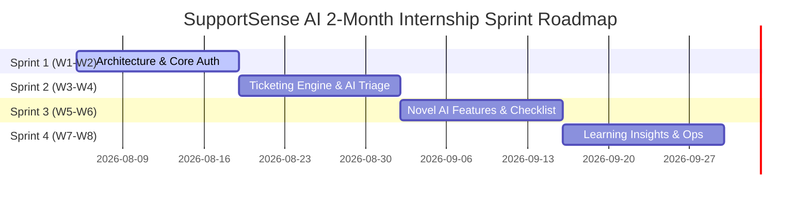

# Module 03: Agile Sprint Planning & Jira Backlog

---

## 6. User Stories & Story Points

| ID | As a... | I want to... | So that... | Story Points |
|---|---|---|---|---|
| **US-01** | Support Agent | see customer mood (`🙂/😐/😠`) and patience score | I can prioritize urgent customer complaints and adapt my tone | 5 |
| **US-02** | Support Agent | get an AI-generated checklist for each ticket | I know exact verification steps without missing critical procedures | 5 |
| **US-03** | Support Agent | check my response quality before sending | I ensure my communication is empathetic, clear, and professional | 8 |
| **US-04** | Support Agent | see an AI summary when a ticket is reopened | I don't have to read 20 past messages to catch up on history | 5 |
| **US-05** | Team Lead | view predicted ticket resolution times | I can set realistic customer expectations and manage team capacity | 5 |
| **US-06** | Knowledge Manager | view weekly AI Learning Insights | I can update FAQ documentation based on top customer issues | 8 |
| **US-07** | Support Agent | see duplicate and related ticket suggestions | I can reuse past verified solutions and merge duplicate tickets | 8 |
| **US-08** | Customer | submit tickets and track real-time status updates | I remain informed on my issue's resolution progress | 3 |
| **US-09** | System Administrator | manage agent roles and system configuration | I maintain secure, role-based access across the platform | 3 |

---

## 7. Product Backlog

```
[Epic 1: Authentication & Core Architecture]
  ├── SSAI-101: Setup PostgreSQL Database schema & migrations (Priority: High, Est: 5 pts)
  ├── SSAI-102: Implement Node.js Express Auth Endpoints & JWT (Priority: High, Est: 5 pts)
  └── SSAI-103: Setup Vite/React Frontend Shell & Tailwind Theme (Priority: High, Est: 3 pts)

[Epic 2: Core Ticketing Engine]
  ├── SSAI-201: Ticket Creation & List APIs (Priority: High, Est: 5 pts)
  ├── SSAI-202: Threaded Message & Internal Notes API (Priority: High, Est: 5 pts)
  └── SSAI-203: Ticket Dashboard & Filter Components (Priority: High, Est: 5 pts)

[Epic 3: AI Intelligence Microservice]
  ├── SSAI-301: FastAPI Microservice Setup & Gemini Integration (Priority: High, Est: 8 pts)
  ├── SSAI-302: AI Auto-Classification & Mood/Patience Analysis (Priority: High, Est: 8 pts)
  ├── SSAI-303: Resolution Predictor & Agent Checklist Generator (Priority: High, Est: 5 pts)
  └── SSAI-304: Pre-send Quality Checker & Reopened Timeline Summarizer (Priority: High, Est: 8 pts)

[Epic 4: Analytics, Insights & Enterprise Features]
  ├── SSAI-401: Weekly AI Learning Insights Engine (Priority: Medium, Est: 8 pts)
  ├── SSAI-402: Admin Analytics Dashboard & SLA Monitoring (Priority: Medium, Est: 5 pts)
  └── SSAI-403: Duplicate Ticket & Related Solution Recommender (Priority: Medium, Est: 5 pts)
```

---

## 8. Sprint Backlog Distribution

- **Sprint 1 Backlog**: SSAI-101, SSAI-102, SSAI-103, SSAI-201 (Base Platform & Ticket CRUD)
- **Sprint 2 Backlog**: SSAI-202, SSAI-203, SSAI-301, SSAI-302 (Threaded Conversations & Base AI Triage)
- **Sprint 3 Backlog**: SSAI-303, SSAI-304, SSAI-403 (Novel AI Features: Checklist, Quality Check, Timeline Summary)
- **Sprint 4 Backlog**: SSAI-401, SSAI-402, Testing, Docker Deployment & Documentation Polish

---

## 9. Agile Sprint Plan (4 Sprints / 8 Weeks)



### Sprint 1 (Weeks 1-2): Foundation & Core Authentication
- Setup Repo structure, PostgreSQL Database schemas, Express API scaffolding, JWT Auth middleware.
- Build React SPA UI Layout with Tailwind CSS, Dark Mode token system.
- *Owner Assignments*: Frontend (Mem 1), Backend (Mem 2), AI Base Setup (Mem 3), Docs/DevOps (Mem 4).

### Sprint 2 (Weeks 3-4): Ticketing Workflow & AI Microservice Foundation
- Implement ticket lifecycle state engine (`Open` -> `In Progress` -> `Resolved`).
- Setup FastAPI microservice connecting to Google Gemini. Implement ticket auto-classification, mood detection, patience score.
- Connect Express backend to FastAPI AI endpoints.

### Sprint 3 (Weeks 5-6): Novel AI Features Integration
- Implement Agent Assist Checklist generation & persistence.
- Implement Pre-send Response Quality Checker with modal drawer in UI.
- Implement Reopened Ticket Timeline Summarizer.
- Implement Resolution Time Predictor.

### Sprint 4 (Weeks 7-8): Enterprise Insights, Testing & Docker Deployment
- Implement Weekly AI Learning Insights background analytics.
- Build comprehensive Analytics & Admin Dashboard.
- Write Unit/Integration tests across Frontend, Backend, and AI Service.
- Package application with Docker Compose and publish final technical documentation.

---

## 10. Jira Epic List

1. **EPIC-01**: Auth & Security System (`SSAI-EPIC-1`)
2. **EPIC-02**: Core Ticket & Communication Engine (`SSAI-EPIC-2`)
3. **EPIC-03**: AI Microservice & Gemini Decision Support (`SSAI-EPIC-3`)
4. **EPIC-04**: Novel Assist Features & Quality Verification (`SSAI-EPIC-4`)
5. **EPIC-05**: Enterprise Analytics & Learning Insights (`SSAI-EPIC-5`)
6. **EPIC-06**: DevOps, Testing & CI/CD Deployment (`SSAI-EPIC-6`)

---

## 11. Jira User Stories & Task Breakdown

### Ticket Example: `SSAI-304` (Response Quality Checker)
- **Summary**: Implement AI Pre-Send Response Quality Verification API & Modal UI.
- **Issue Type**: Story
- **Epic Link**: EPIC-04 (Novel Assist Features)
- **Assignee**: Member 3 (AI Engineer) & Member 1 (Frontend Lead)
- **Description**: Provide agents with an instant AI tone and quality analysis before sending messages.

---

## 12. Acceptance Criteria

### Acceptance Criteria for `SSAI-304` (Response Quality Checker):
1. **GIVEN** an agent has typed a draft response in the ticket reply box,
2. **WHEN** the agent clicks the "Check Response Quality" button,
3. **THEN** the system calls FastAPI `/api/v1/ai/verify-response` with the customer message and agent draft.
4. **AND** the AI microservice returns a JSON payload within 2.0s containing:
   - `scores`: `{ professionalism: 0-100, empathy: 0-100, clarity: 0-100, actionability: 0-100 }`
   - `overall_grade`: String (`"Excellent"`, `"Good"`, `"Needs Improvement"`)
   - `suggestions`: Array of actionable strings.
   - `confidence_score`: Float between 0.00 and 1.00.
5. **AND** the UI renders a modern modal showing breakdown radar/progress bars and 1-click apply for suggestions.
6. **IF** the API fails, the UI gracefully displays a fallback message without losing the agent's drafted text.
