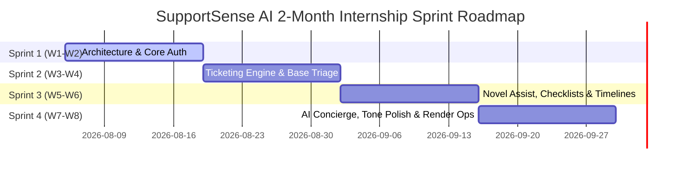

# Module 03: Agile Sprint Planning & Jira Backlog

---

## 6. User Stories & Story Points

| ID | As a... | I want to... | So that... | Story Points |
|---|---|---|---|---|
| **US-01** | Support Agent | see customer mood (`🙂/😐/😠`) and patience score | I can prioritize urgent customer complaints and adapt my tone | 5 |
| **US-02** | Support Agent | get an AI-generated checklist for each ticket | I know exact verification steps without missing critical procedures | 5 |
| **US-03** | Support Agent | check my response quality before sending | I ensure my communication is empathetic, clear, and professional | 8 |
| **US-04** | Support Agent | see an AI summary and banner when a ticket is reopened | I don't have to read 20 past messages to catch up on history | 5 |
| **US-05** | Team Lead | view predicted ticket resolution times | I can set realistic customer expectations and manage team capacity | 5 |
| **US-06** | Knowledge Manager | view weekly AI Learning Insights | I can update FAQ documentation based on top customer issues | 8 |
| **US-07** | Support Agent | polish my response tone with 1 click | I can tailor communication into empathetic, concise, formal, or technical style | 5 |
| **US-08** | Customer | describe issues conversationally with an AI Concierge | I can get immediate diagnostics and dispatch a formal ticket without filling forms | 8 |
| **US-09** | Customer | receive instant departmental confirmation auto-replies | I know my ticket has been received and initial diagnostics have begun | 5 |
| **US-10** | System Administrator | manage agent roles and system configuration | I maintain secure, role-based access across the platform | 3 |
| **US-11** | Backend Lead | ensure ticket and initial message creation is atomic | database consistency is guaranteed if any step in creation fails | 5 |
| **US-12** | Backend Lead | enforce valid ticket status transitions | tickets cannot skip required stages or transition from terminal states | 3 |

---

## 7. Product Backlog

```
[Epic 1: Authentication & Core Architecture]
  ├── SSAI-101: Setup PostgreSQL Database schema, migrations & seeds (Priority: High, Est: 5 pts)
  ├── SSAI-102: Implement Node.js Express Auth Endpoints & JWT (Priority: High, Est: 5 pts)
  └── SSAI-103: Setup Vite/React Frontend Shell & Tailwind Theme (Priority: High, Est: 3 pts)

[Epic 2: Core Ticketing Engine & Resiliency]
  ├── SSAI-201: Ticket Creation & List APIs (Priority: High, Est: 5 pts)
  ├── SSAI-202: Threaded Message & Internal Notes API (Priority: High, Est: 5 pts)
  ├── SSAI-203: Ticket Dashboard & Filter Components (Priority: High, Est: 5 pts)
  ├── SCRUM-110: Connection Pooling & Concurrency Verification (Priority: High, Est: 5 pts)
  ├── SCRUM-111: Strict Ticket Status Transition Validation (Priority: High, Est: 5 pts)
  └── SCRUM-112: Atomic Transactional Ticket & Message Creation (Priority: High, Est: 5 pts)

[Epic 3: AI Intelligence Microservice & Model Optimizations]
  ├── SSAI-301: FastAPI Microservice Setup & Gemini Integration (Priority: High, Est: 8 pts)
  ├── SSAI-302: AI Auto-Classification & Mood/Patience Analysis (Priority: High, Est: 8 pts)
  ├── SSAI-303: Resolution Predictor & Agent Checklist Generator (Priority: High, Est: 5 pts)
  ├── SSAI-304: Pre-send Quality Checker & Suggestion Engine (Priority: High, Est: 8 pts)
  └── SSAI-305: Model Instance Pooling & In-Memory TTL Response Caching (Priority: High, Est: 5 pts)

[Epic 4: Novel Decision Assist & Conversational Workflows]
  ├── SCRUM-113: Reopened Ticket Timeline Summarizer & Banner (Priority: High, Est: 5 pts)
  ├── SCRUM-114: AI Concierge Chatbot & Formal Ticket Crafter (Priority: High, Est: 8 pts)
  ├── SCRUM-115: 1-Click AI Response Tone Polishing Modal (Priority: Medium, Est: 5 pts)
  └── SCRUM-116: Department Automated Response Engine & Policies (Priority: High, Est: 8 pts)

[Epic 5: Analytics, Insights & DevOps Deployment]
  ├── SSAI-401: Weekly AI Learning Insights Engine (Priority: Medium, Est: 8 pts)
  ├── SSAI-402: Admin Analytics Dashboard & SLA Monitoring (Priority: Medium, Est: 5 pts)
  ├── SSAI-403: Render Blueprint (render.yaml) & Docker Compose (Priority: High, Est: 5 pts)
  └── SSAI-404: Automated CI/CD Pipeline with Live PostgreSQL Container (Priority: High, Est: 5 pts)
```

---

## 8. Sprint Backlog Distribution

- **Sprint 1 Backlog**: SSAI-101, SSAI-102, SSAI-103, SSAI-201 (Base Platform & Ticket CRUD)
- **Sprint 2 Backlog**: SSAI-202, SSAI-203, SSAI-301, SSAI-302, SCRUM-110, SCRUM-111 (Threaded Conversations, Status Machine, Base AI Triage)
- **Sprint 3 Backlog**: SSAI-303, SSAI-304, SCRUM-112, SCRUM-113, SCRUM-116 (Checklists, Quality Check, Transactions, Reopened Timeline, Auto-Replies)
- **Sprint 4 Backlog**: SCRUM-114, SCRUM-115, SSAI-305, SSAI-401, SSAI-402, SSAI-403, SSAI-404 (AI Concierge, Tone Polisher, Caching, Insights, CI/CD & Render)

---

## 9. Agile Sprint Plan (4 Sprints / 8 Weeks)



---

## 10. Jira Epic List

1. **EPIC-01**: Auth & Security System (`SSAI-EPIC-1`)
2. **EPIC-02**: Core Ticket & Communication Engine (`SSAI-EPIC-2`)
3. **EPIC-03**: AI Microservice & Gemini Decision Support (`SSAI-EPIC-3`)
4. **EPIC-04**: Novel Decision Assist & Conversational Workflows (`SSAI-EPIC-4`)
5. **EPIC-05**: Enterprise Analytics & Learning Insights (`SSAI-EPIC-5`)
6. **EPIC-06**: DevOps, Testing & CI/CD Deployment (`SSAI-EPIC-6`)

---

## 11. Jira User Stories & Task Breakdown

### Ticket Example: `SCRUM-112` (Atomic Transactional Ticket Creation)
- **Summary**: Implement atomic transaction in `ticketModel.js` for ticket and initial message creation.
- **Issue Type**: Story
- **Epic Link**: EPIC-02 (Core Ticket Engine)
- **Assignee**: Member 2 (Backend Lead)
- **Description**: Ensure tickets and initial messages cannot become orphaned if errors occur during ticket submission.

### Ticket Example: `SCRUM-113` (Reopened Timeline Summarizer)
- **Summary**: Implement async fire-and-forget timeline summarization when ticket status changes from `RESOLVED` to `OPEN`.
- **Issue Type**: Story
- **Epic Link**: EPIC-04 (Novel Decision Assist)
- **Assignee**: Member 2 (Backend) & Member 3 (AI Engineer)

---

## 12. Acceptance Criteria

### Acceptance Criteria for `SCRUM-111` (Status Transitions):
1. **GIVEN** a ticket in status `OPEN`,
2. **WHEN** an agent attempts to transition directly to `RESOLVED` or `CLOSED`,
3. **THEN** the system returns HTTP 400 with an error message: `"Invalid status transition from OPEN to {status}."`.
4. **AND** only `IN_PROGRESS` is accepted as a valid next state.

### Acceptance Criteria for `SCRUM-112` (Transactional Creation):
1. **GIVEN** a customer submits a valid ticket payload,
2. **WHEN** `createTicketWithInitialMessage` executes,
3. **THEN** both the ticket row and initial `ticket_messages` row are committed together atomically.
4. **IF** the message insertion fails (e.g. invalid sender ID),
5. **THEN** the transaction is rolled back and no orphaned ticket is retained in the database.

### Acceptance Criteria for `SCRUM-113` (Reopened Timeline Summary):
1. **GIVEN** a ticket in status `RESOLVED`,
2. **WHEN** an agent updates status to `OPEN`,
3. **THEN** the status update endpoint returns HTTP 200 immediately without blocking on Gemini.
4. **AND** an asynchronous fire-and-forget background worker queries the AI microservice to condense the message history.
5. **AND** updates `ai_metadata.timeline_summary` with `ON CONFLICT (ticket_id) DO UPDATE`.
6. **AND** the UI renders the prominent `TimelineSummaryBanner` at the top of the ticket workspace.
