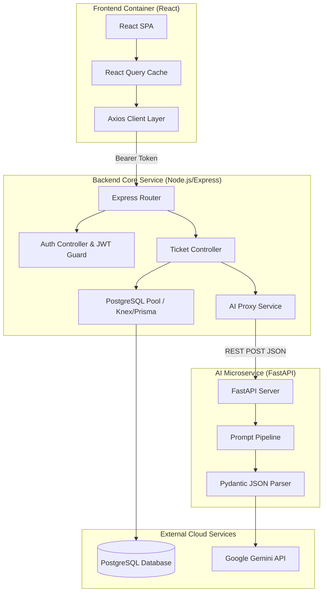
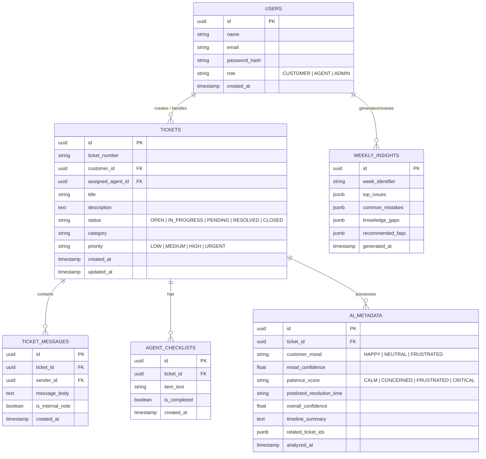
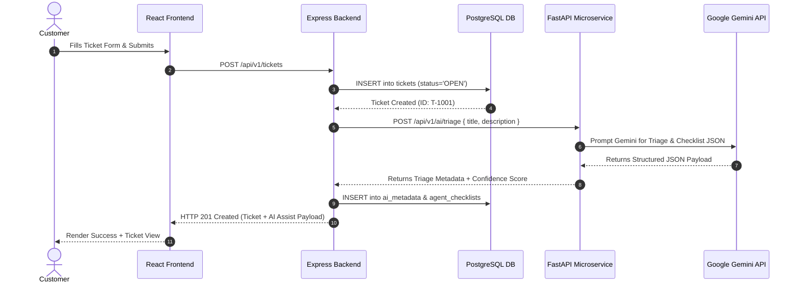

# Module 04: System Architecture & API Specifications

---

## 15. System Architecture

SupportSense AI follows a modern, decoupled **3-Tier Micro-Architecture**:

```
+-----------------------------------------------------------------------------------+
|                                 CLIENT TIER                                       |
|                  React 18 + Vite SPA + Tailwind CSS + Axios                       |
+------------------------------------+----------------------------------------------+
                                     |  HTTP REST (JWT Auth)
                                     v
+-----------------------------------------------------------------------------------+
|                               APPLICATION TIER                                    |
|                       Node.js + Express REST API Server                           |
|      (Auth, Ticket Routing, Business Logic, Analytics Engine, RBAC)                |
+------------------+----------------------------------+-----------------------------+
                   |                                  |
   SQL Queries     |                                  | HTTP Internal REST
                   v                                  v
+------------------+-------------------+  +-----------+-----------------------------+
|          DATABASE TIER               |  |              AI TIER                    |
|        PostgreSQL 15 DB              |  |    Python FastAPI AI Microservice           |
| (Tickets, Users, Messages, Insights) |  | (Google Gemini SDK, Prompt Orchestration)   |
+--------------------------------------+  +--------------------+------------------------+
                                                               | HTTPS
                                                               v
                                                  +------------+------------------------+
                                                  |      Google Gemini 1.5 API         |
                                                  +-------------------------------------+
```

---

## 16. Component Diagram



---

## 17. Database ER Diagram



---

## 18. Sequence Diagrams

### Sequence: Ticket Creation & AI Auto-Triage Flow



---

## 19. API Documentation

### 19.1 Core Backend APIs (`Express REST`)

#### Auth APIs
- `POST /api/v1/auth/register`: Register new Customer/Agent.
- `POST /api/v1/auth/login`: Authenticate and receive JWT access token.
- `GET /api/v1/auth/me`: Get current user profile.

#### Ticket APIs
- `GET /api/v1/tickets`: List tickets with filters (`status`, `priority`, `mood`, `search`).
- `POST /api/v1/tickets`: Create a new ticket (triggers automatic AI triage).
- `GET /api/v1/tickets/:id`: Fetch single ticket with messages, checklist, and AI metadata.
- `PATCH /api/v1/tickets/:id/status`: Update status (e.g. resolve/reopen). Reopening triggers AI summary.
- `POST /api/v1/tickets/:id/messages`: Post message or internal note.
- `PATCH /api/v1/tickets/:id/checklist/:itemId`: Toggle checklist item state.

### 19.2 AI Microservice APIs (`FastAPI REST`)

- `POST /api/v1/ai/triage`: Auto-classifies category, priority, mood, patience score, resolution estimate, and generates checklist.
- `POST /api/v1/ai/verify-response`: Evaluates agent draft reply for professionalism, empathy, clarity, actionability.
- `POST /api/v1/ai/summarize-timeline`: Generates 5-6 bullet history summary for reopened/reassigned tickets.
- `POST /api/v1/ai/generate-weekly-insights`: Aggregates weekly ticket logs to produce top issues and FAQ recommendations.

---

## 20. Security Architecture & Resiliency Specifications

1. **Role Sanitization (Anti-Privilege Escalation)**: Public registration at `/api/v1/auth/register` explicitly sanitizes input role parameters, forcing self-registered users to `CUSTOMER`.
2. **CORS Origin Filtering**: Express and FastAPI enforce explicit origin whitelisting (`ALLOWED_ORIGINS`) to protect Bearer JWT headers and eliminate wildcard `*` credential risks.
3. **Microservice Timeout Resiliency**: All inter-service REST calls from Express backend to FastAPI microservice enforce 5-second HTTP request timeouts using `AbortSignal.timeout(5000)` with graceful HITL fallbacks.
4. **Production Observability**: Configured for structured JSON log formatting when `NODE_ENV=production` alongside detailed system uptime and memory health telemetry `/health`.
