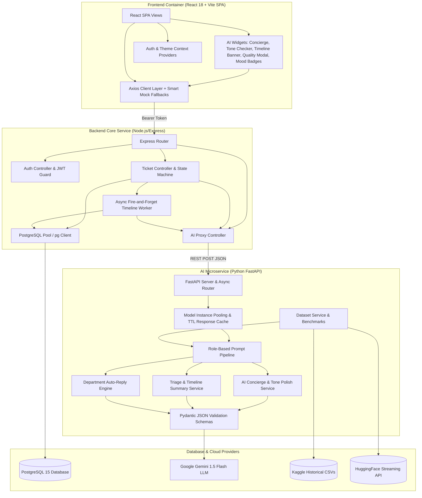
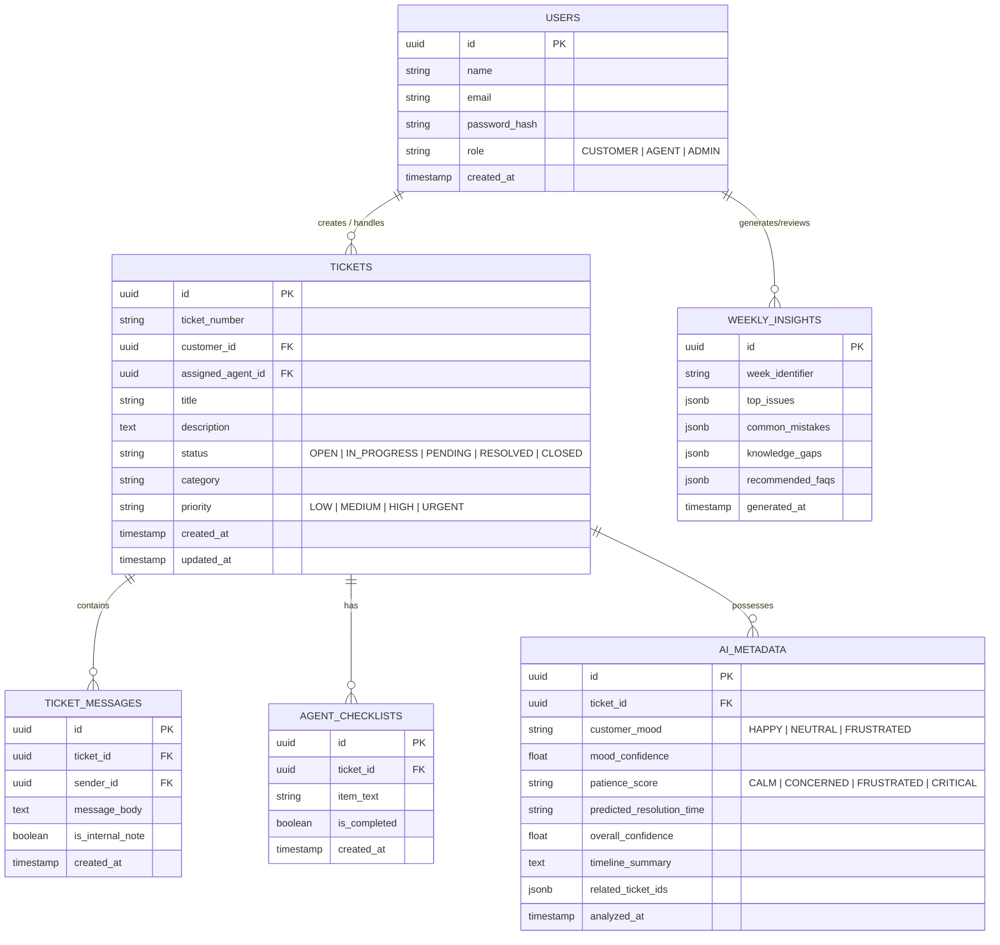
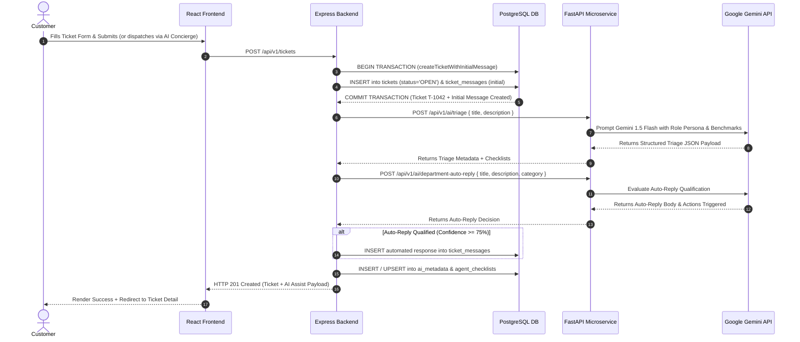
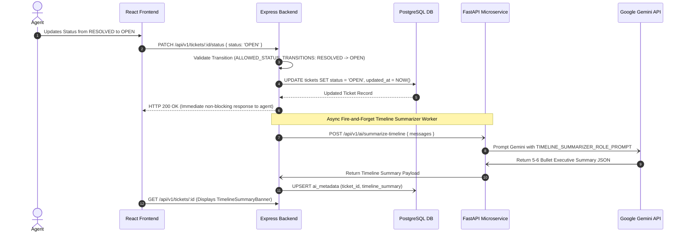

# Module 04: System Architecture & API Specifications

---

## 15. System Architecture

SupportSense AI follows a modern, decoupled **3-Tier Micro-Architecture**:

```
+-----------------------------------------------------------------------------------+
|                                 CLIENT TIER                                       |
|                  React 18 + Vite SPA + Tailwind CSS + Axios                       |
+------------------------------------+----------------------------------------------+
                                     |  HTTP REST (JWT Auth)
                                     v
+-----------------------------------------------------------------------------------+
|                               APPLICATION TIER                                    |
|                       Node.js + Express REST API Server                           |
|      (Auth, Ticket Routing, Business Logic, Analytics Engine, RBAC)                |
+------------------+----------------------------------+-----------------------------+
                   |                                  |
   SQL Queries     |                                  | HTTP Internal REST
                   v                                  v
+------------------+-------------------+  +-----------+-----------------------------+
|          DATABASE TIER               |  |              AI TIER                    |
|        PostgreSQL 15 DB              |  |    Python FastAPI AI Microservice           |
| (Tickets, Users, Messages, Insights) |  | (Google Gemini SDK, Prompt Orchestration)   |
+--------------------------------------+  +--------------------+------------------------+
                                                               | HTTPS
                                                               v
                                                  +------------+------------------------+
                                                  |      Google Gemini 1.5 API         |
                                                  +-------------------------------------+
```

---

## 16. Component Diagram



---

## 17. Database ER Diagram



---

## 18. Sequence Diagrams

### Sequence 1: Transactional Ticket Creation & Department Auto-Reply Flow



### Sequence 2: Reopened Ticket & Async Timeline Summary Flow



---

## 19. API Documentation

### 19.1 Core Backend APIs (`Express REST`)

#### Auth APIs (`/api/v1/auth`)
- `POST /register`: Register new account (self-registration strictly enforces `CUSTOMER` role).
- `POST /login`: Authenticate credentials and receive signed JWT token.
- `GET /me`: Get current authenticated user profile.
- `GET /users`: List all registered users (Admin only).
- `PATCH /users/:id/role`: Update user role (Admin only).

#### Ticket APIs (`/api/v1/tickets`)
- `GET /`: List tickets with filters (`status`, `priority`, `category`, `search`).
- `POST /`: Submit new ticket atomically with its initial message (triggers AI triage & department auto-reply).
- `GET /:id`: Fetch single ticket with messages, checklist, and AI metadata.
- `PATCH /:id/status`: Enforce status transitions (`OPEN` ➔ `IN_PROGRESS` ➔ `RESOLVED` ➔ `CLOSED` or `OPEN`). Reopening triggers async timeline summarizer.
- `POST /:id/forward`: Forward ticket to department with agent comments and internal note.
- `PATCH /:id`: Modify ticket attributes (Admin/Agent escalation override).
- `DELETE /:id`: Delete / Archive ticket record (Admin only).
- `POST /:id/messages`: Post customer reply, agent public message, or internal note.
- `PATCH /:id/checklist/:itemId`: Toggle checklist item completion state.

#### AI Proxy APIs (`/api/v1/ai`)
- `POST /concierge`: AI Concierge Chatbot & Formal Ticket Crafter (accessible to all authenticated roles).
- `POST /polish-tone`: 1-Click AI Response Tone Polishing (`empathetic`, `concise`, `formal`, `technical` — Agent/Admin).
- `POST /verify-response`: Evaluates agent draft reply for Professionalism, Empathy, Clarity, Actionability (Agent/Admin).
- `POST /department-auto-reply`: Evaluates auto-reply eligibility and generates department confirmation (Agent/Admin).
- `GET /departments`: Returns department definitions, handled categories, and active auto-reply rules (Agent/Admin).
- `GET /benchmarks`: Returns historical category SLA duration and priority benchmarks (Agent/Admin).
- `GET /insights`: Fetches weekly AI analytics, top repeated issues, and recommended FAQs (Agent/Admin).

### 19.2 AI Microservice APIs (`FastAPI REST`)

- `POST /api/v1/ai/triage`: Auto-classifies category, priority, mood, patience score, resolution duration, and generates checklist.
- `POST /api/v1/ai/department-auto-reply`: Evaluates category qualification per department and generates automated confirmation message.
- `POST /api/v1/ai/verify-response`: Evaluates pre-send agent response quality and empathy against ticket context.
- `POST /api/v1/ai/summarize-timeline`: Condenses multi-turn message history into a 5-6 bullet executive summary.
- `GET /api/v1/ai/insights`: Returns weekly organizational learning insights and FAQ suggestions.
- `GET /api/v1/ai/datasets/benchmark-metrics`: Returns benchmark resolution metrics derived from Kaggle & Hugging Face datasets.
- `GET /api/v1/ai/datasets/stream-sample`: Streams live sample records from Hugging Face customer support dataset.
- `GET /api/v1/ai/departments/definitions`: Returns configured support departments, categories, and auto-reply policies.
- `POST /api/v1/ai/concierge/chat`: Conversational AI Concierge that accepts natural language queries and crafts enterprise ticket drafts.
- `POST /api/v1/ai/polish-tone`: 1-Click tone polisher rewriting draft responses into Empathetic, Concise, Formal, or Technical styles.

---

## 20. Security Architecture & Resiliency Specifications

1. **Role Sanitization (Anti-Privilege Escalation)**: Public registration at `/api/v1/auth/register` explicitly sanitizes input role parameters, forcing self-registered users to `CUSTOMER`.
2. **CORS Origin Filtering**: Express and FastAPI enforce explicit origin whitelisting (`ALLOWED_ORIGINS`) to protect Bearer JWT headers and eliminate wildcard `*` credential risks.
3. **Microservice Timeout Resiliency**: All inter-service REST calls from Express backend to FastAPI microservice enforce 5-second HTTP request timeouts using `AbortSignal.timeout(5000)` with graceful HITL fallbacks.
4. **Model Instance Pooling & In-Memory TTL Cache**: The AI microservice pools `GenerativeModel` instances and caches responses for 300 seconds using SHA256 hashes, delivering sub-millisecond responses for identical queries.
5. **Database Transactional Integrity & Concurrency**: Atomic ticket creation (`createTicketWithInitialMessage`) and connection pooling (20 max clients) guarantee consistency and collision-free sequence numbers under load.
6. **Production Observability**: Configured for structured JSON log formatting when `NODE_ENV=production` alongside detailed system uptime and memory health telemetry `/health`.
