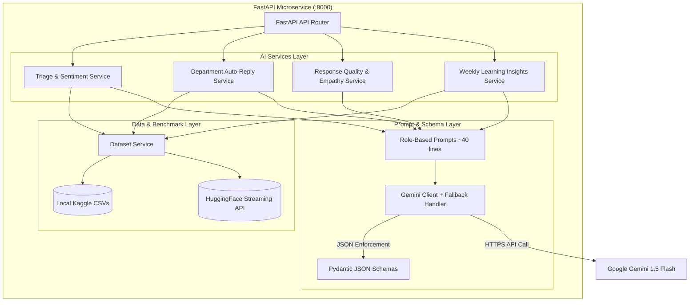

# 🤖 SupportSense AI — AI Implementation, Datasets & Role-Based Prompts Guide
**Target Audience:** AI Engineers, Backend Engineers & Technical Leads  
**Project:** SupportSense AI — Enterprise Customer Support Ticket System  
**Stack:** Python 3.10+, FastAPI, Google Gemini 1.5 Flash, Pydantic v2, Kaggle Datasets & Hugging Face Streaming  

---

## 📑 Table of Contents
1. [AI Architecture & Core Philosophy](#1-ai-architecture--core-philosophy)
2. [Human-in-the-Loop (HITL) Safety Paradigm](#2-human-in-the-loop-hitl-safety-paradigm)
3. [Dataset Grounding, Streaming & Historical Benchmarks](#3-dataset-grounding-streaming--historical-benchmarks)
4. [Specialized Role-Based System Prompts (~40 Lines)](#4-specialized-role-based-system-prompts-40-lines)
5. [Department Automated Response System](#5-department-automated-response-system)
6. [File-by-File AI Code Walkthrough](#6-file-by-file-ai-code-walkthrough)
   - [Core Client & Fallback Engine](#core-client--fallback-engine)
   - [Pydantic Validation Schemas](#pydantic-validation-schemas)
   - [Service Modules](#service-modules)
   - [API Router & Endpoints](#api-router--endpoints)
7. [Testing, Verification & Pytest Suite](#7-testing-verification--pytest-suite)

---

## 1. AI Architecture & Core Philosophy

Rather than using generic, unconstrained large language model (LLM) calls, SupportSense AI implements an **Agentic, Role-Specialized, Dataset-Grounded AI Microservice**.



### Key Pillars
1. **Persona Isolation:** Every AI task is governed by a distinct domain persona (e.g., QA Director, Incident Historian, Triage Officer).
2. **Dataset Grounding:** Forecasts for resolution time and agent action items are not hallucinations; they are calibrated against real Kaggle and Hugging Face customer support records.
3. **Structured JSON Output:** Responses strictly adhere to Pydantic schemas using Gemini's native `response_mime_type: "application/json"`.
4. **Resilient Fallback Mode:** If the Gemini API key is missing or the network drops, deterministic fallback payloads are returned so the application never breaks.

---

## 2. Human-in-the-Loop (HITL) Safety Paradigm

> [!IMPORTANT]
> **Core Principle: AI ASSISTS, HUMANS DECIDE.**

In enterprise customer support, unvetted autonomous actions create liability risks (such as unauthorized financial refunds or irreversible account deletions). SupportSense AI enforces strict HITL safeguards:
- **No Direct Destructive Actions:** The AI generates recommendations, drafted replies, and diagnostic checklists. The human agent inspects and confirms before taking administrative actions.
- **Department Auto-Reply Thresholds:** Automated confirmations are restricted to non-destructive acknowledgments and require a minimum confidence score (e.g., 80%–90%).
- **Pre-Send Empathy Auditing:** Agents can evaluate their draft responses against customer mood and tone before dispatching them.

---

## 3. Dataset Grounding, Streaming & Historical Benchmarks

Implemented in [`ai-service/app/services/dataset_service.py`](file:///D:/Projects/SupportSenseAI/ai-service/app/services/dataset_service.py).

SupportSense AI connects directly to open-source customer support datasets:

| Dataset | Storage / Access | Purpose in SupportSense AI |
| :--- | :--- | :--- |
| **Customer Support Ticket Dataset** | Local Kaggle CSV (`Customer Support Ticket Dataset/customer_support_tickets.csv`) | Provides historical SLA resolution times, priority distributions, and dynamic few-shot examples injected into triage prompts. |
| **Customer Support on Twitter (TWCS)** | Local Kaggle CSV (`Customer Support on Twitter/twcs/twcs.csv` & `sample.csv`) | Supplies real-world conversational turns, de-escalation phrasing, and multi-turn message pacing. |
| **Bitext Customer Support Dataset** | Hugging Face Streaming (`bitext/Bitext-customer-support-llm-chatbot-training-dataset`) | Calibrates category classification for enterprise billing and technical requests with zero-disk streaming (`streaming=True`). |
| **Google GoEmotions & SAMSum** | Hugging Face Streaming | Calibrates customer mood / patience thresholds and conversation condensation benchmarks. |

### How Dataset Benchmarks Are Computed
In [`dataset_service.py`](file:///D:/Projects/SupportSenseAI/ai-service/app/services/dataset_service.py), `get_dataset_benchmark_metrics()` loads historical tickets and computes category metrics:
```python
{
    "Billing": {
        "avg_resolution": "1-2 business days",
        "common_priority": "HIGH",
        "historical_volume": 1240,
        "typical_checklist": [
            "Check payment gateway transaction ID",
            "Verify invoice balance",
            "Issue credit/refund"
        ]
    },
    "Technical": {
        "avg_resolution": "2-3 business days",
        "common_priority": "MEDIUM",
        "historical_volume": 1890,
        "typical_checklist": [
            "Analyze system backend telemetry",
            "Verify client browser / device version",
            "Perform connectivity check"
        ]
    },
    "Account": {
        "avg_resolution": "4-12 hours",
        "common_priority": "HIGH",
        "historical_volume": 940,
        "typical_checklist": [
            "Verify email identity",
            "Unlock authentication token",
            "Dispatch reset instructions"
        ]
    }
}
```
These metrics and few-shot examples are dynamically formatted into the Gemini triage prompt context!

---

## 4. Specialized Role-Based System Prompts (~40 Lines)

All system prompts are maintained in [`ai-service/app/prompts/templates.py`](file:///D:/Projects/SupportSenseAI/ai-service/app/prompts/templates.py). Each prompt is structured with operational guidelines, taxonomy constraints, and output JSON schemas.

### 1. Senior Support Triage Officer & SLA Risk Assessor
- **Prompt Constant:** `TRIAGE_AND_CATEGORIZATION_ROLE_PROMPT`
- **Role:** Analyzes incoming ticket title and description, maps to a strict taxonomy (`Billing`, `Technical`, `Account`, `Feature Request`, `Bug`, `General`), assigns priority (`LOW`, `MEDIUM`, `HIGH`, `URGENT`), detects sentiment (`HAPPY`, `NEUTRAL`, `FRUSTRATED`), evaluates customer patience (`CALM`, `CONCERNED`, `FRUSTRATED`, `CRITICAL`), and generates an agent checklist.
- **Context Injected:** Historical resolution benchmarks from local Kaggle datasets.

### 2. Customer Communications Strategist & Empathy Lead
- **Prompt Constant:** `SUGGESTED_REPLY_ROLE_PROMPT`
- **Role:** Drafts an empathetic, de-escalating first response. Adheres to active listening, calm authority, immediate diagnostic clarity, and avoids unverified liability admissions.

### 3. Autonomous Department Dispatch & SLA Auto-Responder
- **Prompt Constant:** `DEPARTMENT_AUTO_REPLY_ROLE_PROMPT`
- **Role:** Evaluates whether incoming tickets qualify for automated departmental acknowledgment based on department policies, confidence thresholds, and safety criteria.

### 4. Customer Communications QA Director & Empathy Coach
- **Prompt Constant:** `RESPONSE_QUALITY_AUDIT_ROLE_PROMPT`
- **Role:** Pre-send audit tool that scores agent draft responses across 4 key pillars (0–100):
  1. **Professionalism:** Grammar, tone, respectful phrasing.
  2. **Empathy:** Active listening, validation of customer frustration.
  3. **Clarity:** Readability, conciseness, absence of confusing jargon.
  4. **Actionability:** Clear next steps, timeframes, or instructions.
- **Grades:** `EXCELLENT` (>=85), `GOOD` (70–84), `NEEDS_IMPROVEMENT` (<70).

### 5. Senior Incident Historian & Operations Briefing Lead
- **Prompt Constant:** `TIMELINE_SUMMARIZER_ROLE_PROMPT`
- **Role:** When tickets are reopened or reassigned after multiple back-and-forth messages, condenses the thread into a 5-6 bullet chronological executive summary with core facts, root obstacles, and pending escalation actions.

### 6. Enterprise Knowledge Base Architect & Continuous Learning Director
- **Prompt Constant:** `ORGANIZATIONAL_INSIGHTS_ROLE_PROMPT`
- **Role:** Analyzes batches of weekly resolved tickets to identify top recurring friction points, common agent handling mistakes, public documentation gaps, and ready-to-publish FAQ entries.

---

## 5. Department Automated Response System

Configured in [`dataset_service.py`](file:///D:/Projects/SupportSenseAI/ai-service/app/services/dataset_service.py) via `get_department_definitions()`:

| Department | Handled Categories | Min Confidence | Target SLA | Automated Actions Triggered |
| :--- | :--- | :--- | :--- | :--- |
| **Finance & Billing** | Billing, Refund, Invoice, Subscription | 85% | 4 Hours | Payment gateway transaction trace, customer ledger snapshot |
| **Technical Support** | Technical, Bug, Integration, Hardware | 80% | 8 Hours | System status health check, API telemetry error log fetch |
| **Identity & Access** | Account, Login, SSO, Password, MFA | 90% | 2 Hours | User email verification, secure reset token dispatch |
| **API Platform Team** | API Platform, Webhook, Rate Limit, SDK | 85% | 6 Hours | API Gateway rate limit trace, webhook delivery logs inspection |

When a ticket is created, [`auto_reply_service.py`](file:///D:/Projects/SupportSenseAI/ai-service/app/services/auto_reply_service.py) evaluates these rules. If eligible, it constructs an authoritative confirmation message and informs the customer that automated diagnostics have begun.

---

## 6. File-by-File AI Code Walkthrough

### Core Client & Fallback Engine

1. [`ai-service/app/core/config.py`](file:///D:/Projects/SupportSenseAI/ai-service/app/core/config.py)
   - Loads `GEMINI_API_KEY`, `GEMINI_MODEL_NAME` (default `gemini-1.5-flash`), and `ALLOWED_ORIGINS` using `pydantic`/`dotenv`.

2. [`ai-service/app/core/gemini_client.py`](file:///D:/Projects/SupportSenseAI/ai-service/app/core/gemini_client.py)
   - **`generate_json_response(prompt_text, fallback_payload, system_instruction)`:**
     - Checks if an active API key is present. If missing, returns `fallback_payload`.
     - Initializes `genai.GenerativeModel` with `response_mime_type: "application/json"`.
     - Passes `system_instruction` to enforce role personas natively at the model level.
     - Parses and returns the resulting JSON. If an exception occurs, it safely falls back.

---

### Pydantic Validation Schemas

Defined in [`ai-service/app/models/schemas.py`](file:///D:/Projects/SupportSenseAI/ai-service/app/models/schemas.py):

```python
class TriageResponse(BaseModel):
    category: str
    priority: str
    customer_mood: str
    mood_confidence: float = Field(..., ge=0.0, le=1.0)
    patience_score: str
    predicted_resolution_time: str
    overall_confidence: float = Field(..., ge=0.0, le=1.0)
    checklist: List[str]
    suggested_reply: str

class QualityCheckResponse(BaseModel):
    scores: QualityScores  # professionalism, empathy, clarity, actionability (0-100)
    overall_grade: str     # EXCELLENT | GOOD | NEEDS_IMPROVEMENT
    suggestions: List[str]
    confidence_score: float

class DepartmentAutoReplyResponse(BaseModel):
    should_auto_reply: bool
    target_department: str
    confidence_score: float
    automated_reply_body: str
    actions_triggered: List[str]
    requires_human_escalation: bool
    reasoning: Optional[str]
```

---

### Service Modules

1. [`ai-service/app/services/triage_service.py`](file:///D:/Projects/SupportSenseAI/ai-service/app/services/triage_service.py)
   - **`process_ticket_triage(title, description)`:** Pulls dataset benchmarks and few-shot examples, formats `TRIAGE_AND_CATEGORIZATION_ROLE_PROMPT`, calls Gemini, and returns categorized output with checklist and suggested reply.
   - **`process_timeline_summary(messages)`:** Formats threaded messages chronologically, executes `TIMELINE_SUMMARIZER_ROLE_PROMPT`, and returns a 5-6 bullet summary.

2. [`ai-service/app/services/auto_reply_service.py`](file:///D:/Projects/SupportSenseAI/ai-service/app/services/auto_reply_service.py)
   - **`evaluate_department_auto_reply(title, description, category, department_name)`:** Matches categories against department definitions and evaluates auto-reply qualification using `DEPARTMENT_AUTO_REPLY_ROLE_PROMPT`.

3. [`ai-service/app/services/quality_service.py`](file:///D:/Projects/SupportSenseAI/ai-service/app/services/quality_service.py)
   - **`evaluate_response_quality(ticket_context, draft_reply)`:** Evaluates pre-send agent replies against the customer complaint using `RESPONSE_QUALITY_AUDIT_ROLE_PROMPT`.

4. [`ai-service/app/services/insights_service.py`](file:///D:/Projects/SupportSenseAI/ai-service/app/services/insights_service.py)
   - **`generate_weekly_learning_insights(week_identifier)`:** Aggregates ticket samples and generates friction points, mistakes, and FAQ suggestions using `ORGANIZATIONAL_INSIGHTS_ROLE_PROMPT`.

---

### API Router & Endpoints

Defined in [`ai-service/app/api/router.py`](file:///D:/Projects/SupportSenseAI/ai-service/app/api/router.py):

| Method | Endpoint | Request Body / Query | Description |
| :--- | :--- | :--- | :--- |
| `POST` | `/api/v1/ai/triage` | `TriageRequest` (`title`, `description`) | Full classification, mood, resolution forecast, checklist |
| `POST` | `/api/v1/ai/department-auto-reply` | `DepartmentAutoReplyRequest` | Evaluates eligibility & generates automated confirmation |
| `POST` | `/api/v1/ai/verify-response` | `QualityCheckRequest` | Pre-send 4-pillar quality & empathy check |
| `POST` | `/api/v1/ai/summarize-timeline` | `TimelineSummaryRequest` (`messages`) | 5-6 bullet timeline summary for reopened tickets |
| `GET` | `/api/v1/ai/insights` | None | Weekly organizational learning & FAQ synthesis |
| `GET` | `/api/v1/ai/datasets/benchmark-metrics` | None | SLA benchmarks calculated from Kaggle datasets |
| `GET` | `/api/v1/ai/datasets/stream-sample` | `?dataset_name=...&limit=5` | Live streamed records from Hugging Face |
| `GET` | `/api/v1/ai/departments/definitions` | None | Configured departments, categories & rules |

---

## 7. Testing, Verification & Pytest Suite

Tests are located in [`tests/unit/ai-service/`](file:///D:/Projects/SupportSenseAI/tests/unit/ai-service/).

### Running the Test Suite
```bash
cd ai-service
pytest ../tests/unit/ai-service/
```

### What the Unit Tests Cover
1. **[`test_ai_features.py`](file:///D:/Projects/SupportSenseAI/tests/unit/ai-service/test_ai_features.py):**
   - Verifies Kaggle CSV ticket loading and benchmark calculations.
   - Tests department auto-reply qualification for Billing and Technical categories.
   - Validates role-based triage output schema (categories, priorities, checklist arrays).
   - Tests response quality scoring (Professionalism, Empathy, Clarity, Actionability).
   - Validates weekly learning insights and FAQ generation.
2. **[`test_triage.py`](file:///D:/Projects/SupportSenseAI/tests/unit/ai-service/test_triage.py):**
   - Tests edge cases such as empty bodies, high-urgency keywords, and sentiment classification.
