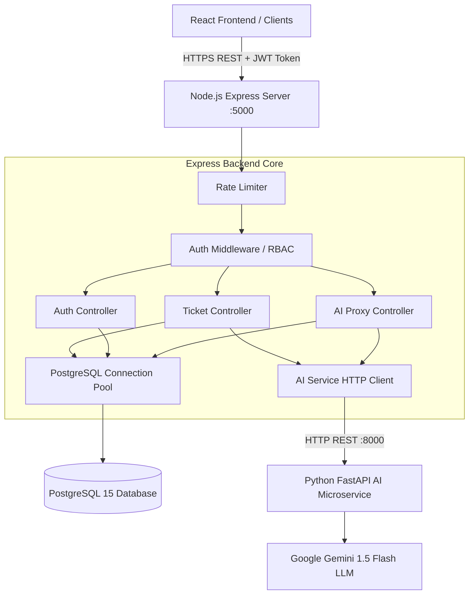
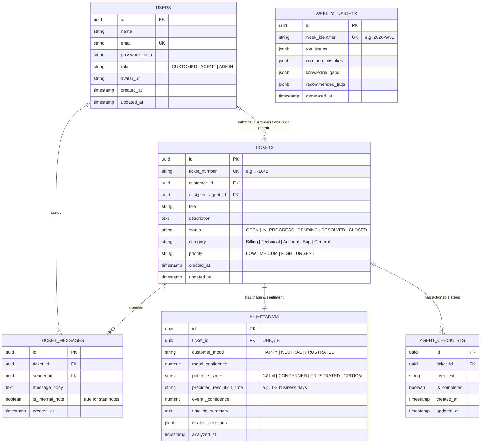
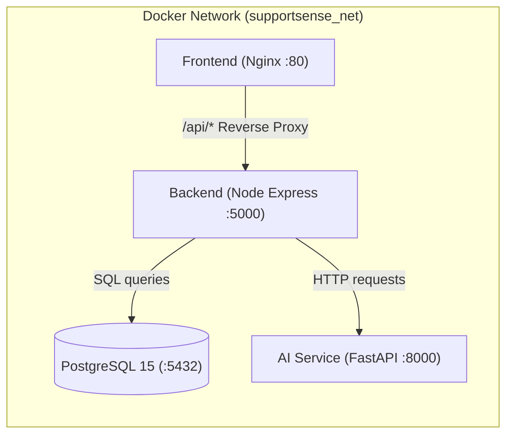

# 🛠️ SupportSense AI — Backend, API & DevOps Engineering Guide
**Target Audience:** Backend Developers (2 Team Members)  
**Project:** SupportSense AI — Enterprise Customer Support Ticket System  
**Stack:** Node.js (v18+), Express.js, PostgreSQL 15, Docker & Render.com  

---

## 📑 Table of Contents
1. [Backend Overview & Architecture](#1-backend-overview--architecture)
2. [Team Division & Responsibilities](#2-team-division--responsibilities)
3. [Database Architecture & PostgreSQL Schema](#3-database-architecture--postgresql-schema)
4. [File-by-File Code Walkthrough](#4-file-by-file-code-walkthrough)
   - [Entrypoint & Config](#entrypoint--config)
   - [Database Layer & DAO](#database-layer--dao)
   - [Middleware Layer](#middleware-layer)
   - [Controllers & Business Logic](#controllers--business-logic)
   - [Routes Layer](#routes-layer)
   - [External Services & Utilities](#external-services--utilities)
5. [Complete API Reference & Handling](#5-complete-api-reference--handling)
6. [DevOps, Docker & Cloud Deployment](#6-devops-docker--cloud-deployment)
7. [Local Setup, Testing & Troubleshooting](#7-local-setup-testing--troubleshooting)

---

## 1. Backend Overview & Architecture

SupportSense AI backend acts as the central brain and data authority of the 3-tier system:
1. **Client Tier (Frontend):** React 18 SPA communicates with the Backend via REST APIs using JWT Bearer tokens.
2. **Application Tier (Express Backend):** Handles authentication, business logic, role-based access control (RBAC), database persistence, rate limiting, and forwards AI tasks to the Python FastAPI service.
3. **Data Tier (PostgreSQL):** Stores relational data (users, tickets, messages, AI metadata, checklists, and weekly insights).
4. **AI Microservice (FastAPI + Gemini):** Dedicated microservice for AI classification, sentiment detection, automated replies, and dataset benchmarks.



---

## 2. Team Division & Responsibilities

To ensure smooth collaboration, work is divided between **2 Backend Engineers**:

| Role | Engineer | Focus Areas | Key Codebase Files |
| :--- | :--- | :--- | :--- |
| **Backend Engineer 1** | **Core API & Database Lead** | Database models, SQL migrations, User Authentication, JWT security, Ticket CRUD, Threaded Messaging, and Checklists | [`db.js`](file:///D:/Projects/SupportSenseAI/backend/src/config/db.js), [`userModel.js`](file:///D:/Projects/SupportSenseAI/backend/src/models/userModel.js), [`ticketModel.js`](file:///D:/Projects/SupportSenseAI/backend/src/models/ticketModel.js), [`authController.js`](file:///D:/Projects/SupportSenseAI/backend/src/controllers/authController.js), [`ticketController.js`](file:///D:/Projects/SupportSenseAI/backend/src/controllers/ticketController.js), [`authRoutes.js`](file:///D:/Projects/SupportSenseAI/backend/src/routes/authRoutes.js), [`ticketRoutes.js`](file:///D:/Projects/SupportSenseAI/backend/src/routes/ticketRoutes.js) |
| **Backend Engineer 2** | **AI Integration, DevOps & Cloud Deployment** | AI Proxy routing, Fast-fail HTTP client for AI microservice, Rate limiting, Error handling, Docker Compose, Render CI/CD, and automated database initialization | [`aiService.js`](file:///D:/Projects/SupportSenseAI/backend/src/services/aiService.js), [`aiProxyController.js`](file:///D:/Projects/SupportSenseAI/backend/src/controllers/aiProxyController.js), [`aiProxyRoutes.js`](file:///D:/Projects/SupportSenseAI/backend/src/routes/aiProxyRoutes.js), [`authMiddleware.js`](file:///D:/Projects/SupportSenseAI/backend/src/middleware/authMiddleware.js), [`errorHandler.js`](file:///D:/Projects/SupportSenseAI/backend/src/middleware/errorHandler.js), [`rateLimiter.js`](file:///D:/Projects/SupportSenseAI/backend/src/middleware/rateLimiter.js), [`dbInit.js`](file:///D:/Projects/SupportSenseAI/backend/src/config/dbInit.js), [`Dockerfile`](file:///D:/Projects/SupportSenseAI/backend/Dockerfile), [`docker-compose.yml`](file:///D:/Projects/SupportSenseAI/deployment/docker-compose.yml), [`render.yaml`](file:///D:/Projects/SupportSenseAI/render.yaml) |

---

## 3. Database Architecture & PostgreSQL Schema

The database schema is defined in [`001_init_schema.sql`](file:///D:/Projects/SupportSenseAI/database/migrations/001_init_schema.sql) and populated with initial test data in [`001_seed_data.sql`](file:///D:/Projects/SupportSenseAI/database/seeds/001_seed_data.sql).

### Entity Relationship Diagram (ERD)



### Key Performance Indexes
To keep search and filtering instantaneous, indexes are placed on:
- `tickets(status, priority)`: Speeds up queue filtering for support agents.
- `tickets(customer_id)`: Speeds up customer ticket queries.
- `ticket_messages(ticket_id, created_at ASC)`: Loads conversation history in order.
- `ai_metadata(ticket_id)` and `agent_checklists(ticket_id)`: Loads ticket details in a single step.

---

## 4. File-by-File Code Walkthrough

### Entrypoint & Config

1. [`backend/server.js`](file:///D:/Projects/SupportSenseAI/backend/server.js)
   - **What it does:** The bootstrap file for the Node process.
   - **Implementation:** Calls `initializeDatabase()` to ensure PostgreSQL tables exist, binds Express to the configured port (default `5000`), logs server startup, and listens for `SIGTERM` signals for graceful shutdown.

2. [`backend/src/app.js`](file:///D:/Projects/SupportSenseAI/backend/src/app.js)
   - **What it does:** Configures Express application middleware, routes, and error handlers.
   - **Implementation:**
     - Enforces security HTTP headers using `helmet()`.
     - Configures `cors()` with origin validation supporting local development, Render URLs, and mobile clients.
     - Parses incoming JSON and URL-encoded bodies.
     - Mounts `apiLimiter` globally on `/api/`.
     - Sets up Swagger UI at `/api-docs`.
     - Exposes health check at `/health`.
     - Mounts route groups: `/api/v1/auth`, `/api/v1/tickets`, `/api/v1/ai`.
     - Mounts `globalErrorHandler` as the last middleware.

3. [`backend/src/config/env.js`](file:///D:/Projects/SupportSenseAI/backend/src/config/env.js)
   - **What it does:** Centralized environment variable loader.
   - **Implementation:** Uses `dotenv` to load `.env` variables (e.g., `PORT`, `NODE_ENV`, `JWT_SECRET`, `DB_HOST`, `DB_PORT`, `DB_NAME`, `DB_USER`, `DB_PASSWORD`, `AI_SERVICE_URL`). Provides safe defaults and prints warnings in production if default secrets are used.

4. [`backend/src/config/db.js`](file:///D:/Projects/SupportSenseAI/backend/src/config/db.js)
   - **What it does:** Configures the PostgreSQL connection pool using `pg`.
   - **Implementation:** Supports both direct connection parameters (`DB_HOST`, etc.) and cloud connection strings (`DATABASE_URL`). Sets pool connection timeouts, max clients (20), and exports a `query(text, params)` helper that logs execution timing in development mode.

5. [`backend/src/config/dbInit.js`](file:///D:/Projects/SupportSenseAI/backend/src/config/dbInit.js)
   - **What it does:** Auto-migration runner on server startup.
   - **Implementation:** Checks if the `users` table exists. If absent (such as when starting a fresh Docker container or cloud deployment on Render), it automatically reads and executes [`001_init_schema.sql`](file:///D:/Projects/SupportSenseAI/database/migrations/001_init_schema.sql) followed by [`001_seed_data.sql`](file:///D:/Projects/SupportSenseAI/database/seeds/001_seed_data.sql).

---

### Database Layer & DAO

1. [`backend/src/models/userModel.js`](file:///D:/Projects/SupportSenseAI/backend/src/models/userModel.js)
   - **Functions:**
     - `findUserByEmail(email)`: Queries user by email for login validation.
     - `findUserById(id)`: Returns user profile excluding sensitive password hash.
     - `createUser({ name, email, passwordHash, role, avatarUrl })`: Inserts new user record using parameterized SQL.
     - `getAllUsers()`: Lists all users for Admin management.
     - `updateUserRole(id, role)`: Updates user role (`CUSTOMER`, `AGENT`, `ADMIN`).

2. [`backend/src/models/ticketModel.js`](file:///D:/Projects/SupportSenseAI/backend/src/models/ticketModel.js)
   - **Functions:**
     - `generateTicketNumber()`: Generates human-friendly identifiers (e.g. `T-1001`, `T-1002`).
     - `createTicket({ customerId, title, description, category, priority })`: Inserts a new ticket with status `OPEN`.
     - `getAllTickets({ status, priority, search, userRole, userId })`: Queries tickets with dynamic SQL filtering and role guard (Customers only see their own tickets).
     - `getTicketById(ticketId, userRole)`: Queries ticket details, sender info, threaded messages (excluding internal notes if `userRole === 'CUSTOMER'`), AI metadata, and checklists.
     - `updateTicketStatus(ticketId, { status, assignedAgentId })`: Modifies status and assigns agents.
     - `modifyTicket(ticketId, fields)`: Safe dynamic SQL updater for administrative overrides.
     - `deleteTicket(ticketId)`: Deletes ticket by UUID.
     - `createMessage({ ticketId, senderId, messageBody, isInternalNote })`: Adds a customer reply or agent note.
     - `toggleChecklistItem(itemId, isCompleted)`: Toggles completion state of agent checklists.

3. [`backend/src/models/aiMetadataModel.js`](file:///D:/Projects/SupportSenseAI/backend/src/models/aiMetadataModel.js)
   - **Functions:**
     - `saveAIMetadata(...)`: Uses `ON CONFLICT (ticket_id) DO UPDATE` (upsert) to store mood, confidence scores, patience score, predicted resolution time, and timeline summary.
     - `saveAgentChecklist(ticketId, itemsArray)`: Clears existing checklist for the ticket and batch-inserts the AI-generated verification steps.
     - `updateTimelineSummary(ticketId, timelineSummary)`: Updates timeline bullet summary when a ticket is reopened or reassigned.
     - `getLatestWeeklyInsights()`: Returns the newest weekly analytical summary.

---

### Middleware Layer

1. [`backend/src/middleware/authMiddleware.js`](file:///D:/Projects/SupportSenseAI/backend/src/middleware/authMiddleware.js)
   - **`authenticateToken(req, res, next)`:** Extracts Bearer token from `Authorization` header, verifies signature using `jwt.verify()`, and attaches payload to `req.user`. Returns 401 if missing and 403 if expired or invalid.
   - **`authorizeRoles(...allowedRoles)`:** Checks if `req.user.role` matches the required permission levels (e.g., `authorizeRoles('AGENT', 'ADMIN')`).

2. [`backend/src/middleware/errorHandler.js`](file:///D:/Projects/SupportSenseAI/backend/src/middleware/errorHandler.js)
   - **What it does:** Catches uncaught synchronous and asynchronous errors from controllers.
   - **Implementation:** Logs error stack traces with request method and URL, returning standardized JSON error payloads. In development, includes stack traces; in production, returns sanitized error messages.

3. [`backend/src/middleware/rateLimiter.js`](file:///D:/Projects/SupportSenseAI/backend/src/middleware/rateLimiter.js)
   - **`apiLimiter`:** Standard rate limiter allowing 100 requests per 15 minutes per IP.
   - **`authLimiter`:** Strict limiter for `/api/v1/auth/login` and `/api/v1/auth/register` allowing only 10 attempts per 15 minutes to prevent brute-force attacks.

---

### Controllers & Business Logic

1. [`backend/src/controllers/authController.js`](file:///D:/Projects/SupportSenseAI/backend/src/controllers/authController.js)
   - **`register`:** Validates fields, checks for duplicate email, hashes passwords with bcrypt (10 salt rounds), forces public registrations to `CUSTOMER` role (preventing privilege escalation unless initiated by an Admin), creates user, and returns signed JWT.
   - **`login`:** Validates credentials against bcrypt hash, signs JWT with 1-hour expiration, and returns sanitized user info.
   - **`getMe`:** Returns current logged-in user profile.
   - **`getUsers` & `updateUserRole`:** Admin-only endpoints for viewing and managing user roles.

2. [`backend/src/controllers/ticketController.js`](file:///D:/Projects/SupportSenseAI/backend/src/controllers/ticketController.js)
   - **`createTicket` Workflow:**
     1. Creates ticket in DB.
     2. Inserts customer message into thread.
     3. Calls `aiService.performAITriage(title, description)`.
     4. Persists AI metadata and agent checklists to PostgreSQL.
     5. Calls `aiService.evaluateDepartmentAutoReply(...)`. If confidence >= 75% and auto-reply is enabled, posts an automated response message to the ticket thread.
     6. Returns complete ticket object with metadata and checklists.
   - **`getTickets` & `getTicketById`:** Retrieves list and details with role-based filtering.
   - **`updateStatus`:** Updates status. If transitioning from `RESOLVED` to `OPEN` (ticket reopened), it triggers `aiService.summarizeTimeline()` to generate an updated 5-6 bullet history summary.
   - **`forwardTicket`:** Reassigns department and adds an internal handover note.
   - **`modifyTicket` & `deleteTicket`:** Admin override controls.
   - **`postMessage`:** Adds replies or internal notes (sanitizing customer inputs so customers cannot post internal notes).
   - **`toggleChecklist`:** Updates checklist completion.

3. [`backend/src/controllers/aiProxyController.js`](file:///D:/Projects/SupportSenseAI/backend/src/controllers/aiProxyController.js)
   - **`verifyResponse`:** Takes ticket context and draft reply, forwards to AI service, and returns 4-pillar quality scores (Professionalism, Empathy, Clarity, Actionability).
   - **`getWeeklyInsights`:** Returns aggregated friction points, common mistakes, and recommended FAQs.
   - **`evaluateAutoReply`:** Manually tests auto-reply policies for a given ticket.
   - **`getDepartmentRules`:** Fetches configured departments and categories.
   - **`getBenchmarks`:** Returns SLA duration metrics grounded in historical datasets.

---

### External Services & Utilities

1. [`backend/src/services/aiService.js`](file:///D:/Projects/SupportSenseAI/backend/src/services/aiService.js)
   - **What it does:** HTTP communication layer between Express and FastAPI (`http://localhost:8000` or `http://ai-service:8000`).
   - **Resilience Design:** Every request has a `5000ms` abort timeout (`AbortSignal.timeout(5000)`). If the AI service is unreachable or errors out, graceful fallback responses are returned so the backend NEVER crashes or stalls customer tickets.

2. [`backend/src/utils/logger.js`](file:///D:/Projects/SupportSenseAI/backend/src/utils/logger.js)
   - Provides structured JSON logging in production and formatted terminal logs in development.

3. [`backend/src/utils/responseFormatter.js`](file:///D:/Projects/SupportSenseAI/backend/src/utils/responseFormatter.js)
   - Standardizes all API outputs into `{ success: true|false, message: string, data: any, error?: any }`.

---

## 5. Complete API Reference & Handling

All endpoints (except login and register) require `Authorization: Bearer <JWT_TOKEN>`.

### Authentication Endpoints (`/api/v1/auth`)

| Method | Endpoint | Access | Body Payload | Description |
| :--- | :--- | :--- | :--- | :--- |
| `POST` | `/api/v1/auth/register` | Public | `{ "name", "email", "password" }` | Register new customer account |
| `POST` | `/api/v1/auth/login` | Public | `{ "email", "password" }` | Login and obtain JWT token |
| `GET` | `/api/v1/auth/me` | Authenticated | None | Get current authenticated user profile |
| `GET` | `/api/v1/auth/users` | Admin Only | None | List all registered users |
| `PATCH` | `/api/v1/auth/users/:id/role` | Admin Only | `{ "role": "AGENT" }` | Update user permission role |

### Ticket Management Endpoints (`/api/v1/tickets`)

| Method | Endpoint | Access | Query / Body Payload | Description |
| :--- | :--- | :--- | :--- | :--- |
| `POST` | `/api/v1/tickets` | Authenticated | `{ "title", "description", "category", "priority" }` | Submit ticket; runs AI triage & auto-reply |
| `GET` | `/api/v1/tickets` | Authenticated | `?status=OPEN&priority=HIGH&search=billing` | List tickets with optional filters |
| `GET` | `/api/v1/tickets/:id` | Authenticated | None | Get full ticket details, messages & AI metadata |
| `PATCH` | `/api/v1/tickets/:id/status` | Agent, Admin | `{ "status": "IN_PROGRESS", "assignedAgentId": "uuid" }` | Update status (Reopening auto-updates timeline) |
| `POST` | `/api/v1/tickets/:id/forward` | Agent, Admin | `{ "targetDepartment", "comments", "assignedAgentId" }` | Route ticket to another department |
| `PATCH` | `/api/v1/tickets/:id` | Agent, Admin | `{ "title", "description", "category", "priority" }` | Modify ticket properties |
| `DELETE` | `/api/v1/tickets/:id` | Admin Only | None | Delete ticket record |
| `POST` | `/api/v1/tickets/:id/messages` | Authenticated | `{ "messageBody", "isInternalNote": false }` | Post customer reply or internal agent note |
| `PATCH` | `/api/v1/tickets/:id/checklist/:itemId` | Agent, Admin | `{ "isCompleted": true }` | Toggle AI checklist verification item |

### AI Decision Support Endpoints (`/api/v1/ai`)

| Method | Endpoint | Access | Body Payload | Description |
| :--- | :--- | :--- | :--- | :--- |
| `POST` | `/api/v1/ai/verify-response` | Agent, Admin | `{ "ticketContext", "draftReply" }` | Evaluates tone, empathy, clarity & actionability |
| `GET` | `/api/v1/ai/insights` | Agent, Admin | None | Fetch weekly organizational learning & FAQs |
| `POST` | `/api/v1/ai/department-auto-reply` | Agent, Admin | `{ "title", "description", "category", "departmentName" }` | Evaluates automated department response |
| `GET` | `/api/v1/ai/departments` | Agent, Admin | None | Get department definitions & auto-reply rules |
| `GET` | `/api/v1/ai/benchmarks` | Agent, Admin | None | Get dataset-grounded SLA resolution benchmarks |

---

## 6. DevOps, Docker & Cloud Deployment

SupportSense AI supports **1-Click Containerized Deployment** locally via Docker Compose and in the cloud via Render.com.

### Docker Multi-Container Architecture



### Dockerfile Breakdown

1. **Backend Dockerfile ([`backend/Dockerfile`](file:///D:/Projects/SupportSenseAI/backend/Dockerfile)):**
   - Base image: `node:18-alpine` (lightweight Alpine Linux).
   - Installs production dependencies via `npm ci --only=production`.
   - Copies backend source files.
   - Exposes port `5000` and starts `node server.js`.

2. **Docker Compose ([`deployment/docker-compose.yml`](file:///D:/Projects/SupportSenseAI/deployment/docker-compose.yml)):**
   - **`postgres`:** Starts PostgreSQL 15 Alpine, mounts volume `postgres_data`, runs healthcheck (`pg_isready`), and executes migration scripts on initial run.
   - **`ai-service`:** Builds FastAPI service, binds port `8000`, and passes `GEMINI_API_KEY`.
   - **`backend`:** Depends on `postgres` (healthy) and `ai-service` (started), injects connection URLs, and starts Express on port `5000`.
   - **`frontend`:** Builds React production bundle, serves via Nginx on port `80`, and proxies `/api/` to backend.

3. **Render Blueprint ([`render.yaml`](file:///D:/Projects/SupportSenseAI/render.yaml)):**
   - Defines a managed PostgreSQL database (`supportsense-db`).
   - Defines Docker web services for `supportsense-ai-service` and `supportsense-backend`.
   - Injects `DATABASE_URL` directly from the database resource into the backend.
   - Defines static site deployment for `supportsense-frontend` with automatic SPA rewrites (`/*` -> `/index.html`).

4. **GitHub Actions CI/CD ([`.github/workflows/ci.yml`](file:///D:/Projects/SupportSenseAI/.github/workflows/ci.yml)):**
   - Runs automatically on pull requests and pushes to `main`/`master`.
   - Executes backend unit tests (`npm test`), frontend build check (`npm run build`), and Python pytest suite.

---

## 7. Local Setup, Testing & Troubleshooting

### Local Development Quickstart

1. **Clone & Configure Environment:**
   ```bash
   cp .env.example .env
   # Edit .env and supply GEMINI_API_KEY (optional for mock mode)
   ```

2. **Run with Docker Compose (Recommended):**
   ```bash
   cd deployment
   docker-compose up --build
   ```
   - Frontend: `http://localhost`
   - Backend API: `http://localhost:5000`
   - Swagger UI: `http://localhost:5000/api-docs`
   - AI Service: `http://localhost:8000/api/v1/docs`

3. **Running Backend Standalone (Without Docker):**
   ```bash
   # Ensure local PostgreSQL is running on port 5432
   cd backend
   npm install
   npm run dev   # or npm start
   ```

### Running Backend Unit & Integration Tests
```bash
cd backend
npm test
```
Tests are located in:
- [`tests/unit/backend/auth.test.js`](file:///D:/Projects/SupportSenseAI/tests/unit/backend/auth.test.js): Validates bcrypt hashing and JWT token signing/verification.
- [`tests/unit/backend/ticket.test.js`](file:///D:/Projects/SupportSenseAI/tests/unit/backend/ticket.test.js): Validates ticket schema and data structures.
- [`tests/integration/api.test.js`](file:///D:/Projects/SupportSenseAI/tests/integration/api.test.js): Tests end-to-end API route responses.

### Common Troubleshooting Tips

| Issue | Root Cause | Solution |
| :--- | :--- | :--- |
| `ECONNREFUSED 127.0.0.1:5432` | PostgreSQL is not running or credentials in `.env` are mismatched | Verify PostgreSQL service is active and check `DB_HOST`, `DB_PORT`, `DB_PASSWORD` in `.env`. |
| `AI Service HTTP 500 / Timeout` | AI microservice is down or network latency exceeded 5s | The backend will automatically return safe HITL fallback data. Verify FastAPI is running at `AI_SERVICE_URL`. |
| `CORS Error in Browser` | Frontend origin is missing from `ALLOWED_ORIGINS` | Add your frontend port/domain (e.g. `http://localhost:5173`) to `ALLOWED_ORIGINS` in `.env`. |
| `Token Expired / 403 Forbidden` | JWT token expired after 1 hour | Log in again via `/api/v1/auth/login` to obtain a fresh Bearer token. |
