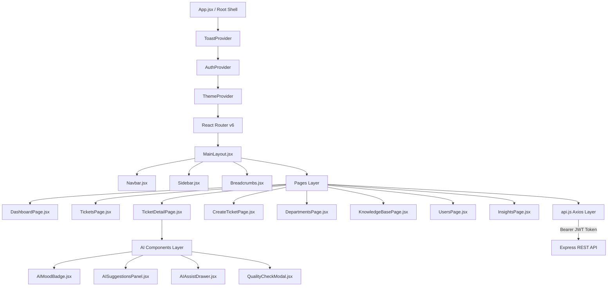

# 🎨 SupportSense AI — Frontend Engineering & UI/UX Guide
**Target Audience:** Frontend Developers (2 Team Members)  
**Project:** SupportSense AI — Enterprise Customer Support Ticket System  
**Stack:** React 18, Vite, Tailwind CSS, React Router v6, Axios, Lucide Icons  

---

## 📑 Table of Contents
1. [Frontend Architecture & Design Philosophy](#1-frontend-architecture--design-philosophy)
2. [Team Division & Responsibilities](#2-team-division--responsibilities)
3. [Global State & Context Providers](#3-global-state--context-providers)
4. [File-by-File Component & Page Walkthrough](#4-file-by-file-component--page-walkthrough)
   - [Application Shell & Layout](#application-shell--layout)
   - [Common UI Components](#common-ui-components)
   - [AI Decision-Support Components](#ai-decision-support-components)
   - [Pages & Workflows](#pages--workflows)
5. [API Layer, Axios Interceptors & Mock Fallbacks](#5-api-layer-axios-interceptors--mock-fallbacks)
6. [Multi-Role Persona Switching (Customer, Agent, Admin)](#6-multi-role-persona-switching-customer-agent-admin)
7. [Running Locally, Building & Production Setup](#7-running-locally-building--production-setup)

---

## 1. Frontend Architecture & Design Philosophy

SupportSense AI frontend is engineered as a modern, high-performance Single Page Application (SPA) prioritizing **operational clarity, enterprise aesthetics, zero lag, and role-tailored workflows**:
- **Design Language:** Clean, dense enterprise design system inspired by Linear and Stripe, featuring crisp borders, subtle elevation, and high-contrast typography.
- **Theme Support:** Native Light, Dark, and System preference modes with zero layout shift.
- **Performance:** Lazy loading on all major page routes via `React.lazy()` and `Suspense`.
- **Offline & Standalone Resilience:** The frontend includes built-in mock fallback data in [`api.js`](file:///D:/Projects/SupportSenseAI/frontend/src/services/api.js) so UI development and demo presentations work seamlessly even if the backend or AI microservice is offline.



---

## 2. Team Division & Responsibilities

To maximize productivity, tasks are divided between **2 Frontend Engineers**:

| Role | Engineer | Focus Areas | Key Codebase Files |
| :--- | :--- | :--- | :--- |
| **Frontend Engineer 1** | **Core UI/UX, Layouts & Common Components** | Design System, Theming, Navigation, Layouts, Common Component Library, AuthContext, Persona Switching, and Table/Filtering | [`MainLayout.jsx`](file:///D:/Projects/SupportSenseAI/frontend/src/layouts/MainLayout.jsx), [`Navbar.jsx`](file:///D:/Projects/SupportSenseAI/frontend/src/components/common/Navbar.jsx), [`Sidebar.jsx`](file:///D:/Projects/SupportSenseAI/frontend/src/components/common/Sidebar.jsx), [`ThemeContext.jsx`](file:///D:/Projects/SupportSenseAI/frontend/src/context/ThemeContext.jsx), [`AuthContext.jsx`](file:///D:/Projects/SupportSenseAI/frontend/src/context/AuthContext.jsx), [`Button.jsx`](file:///D:/Projects/SupportSenseAI/frontend/src/components/common/Button.jsx), [`Card.jsx`](file:///D:/Projects/SupportSenseAI/frontend/src/components/common/Card.jsx), [`Table.jsx`](file:///D:/Projects/SupportSenseAI/frontend/src/components/common/Table.jsx), [`DashboardPage.jsx`](file:///D:/Projects/SupportSenseAI/frontend/src/pages/DashboardPage.jsx), [`TicketsPage.jsx`](file:///D:/Projects/SupportSenseAI/frontend/src/pages/TicketsPage.jsx) |
| **Frontend Engineer 2** | **AI Features, Ticket Workflows & API Client** | Ticket Detail screen, Threaded Messaging, AI Mood Badges, AI Suggested Replies, Response Quality Check Modal, Knowledge Base, Departments, and Axios API Client | [`TicketDetailPage.jsx`](file:///D:/Projects/SupportSenseAI/frontend/src/pages/TicketDetailPage.jsx), [`CreateTicketPage.jsx`](file:///D:/Projects/SupportSenseAI/frontend/src/pages/CreateTicketPage.jsx), [`AIMoodBadge.jsx`](file:///D:/Projects/SupportSenseAI/frontend/src/components/ai/AIMoodBadge.jsx), [`AISuggestionsPanel.jsx`](file:///D:/Projects/SupportSenseAI/frontend/src/components/ai/AISuggestionsPanel.jsx), [`QualityCheckModal.jsx`](file:///D:/Projects/SupportSenseAI/frontend/src/components/ai/QualityCheckModal.jsx), [`AIAssistDrawer.jsx`](file:///D:/Projects/SupportSenseAI/frontend/src/components/ai/AIAssistDrawer.jsx), [`DepartmentsPage.jsx`](file:///D:/Projects/SupportSenseAI/frontend/src/pages/DepartmentsPage.jsx), [`KnowledgeBasePage.jsx`](file:///D:/Projects/SupportSenseAI/frontend/src/pages/KnowledgeBasePage.jsx), [`api.js`](file:///D:/Projects/SupportSenseAI/frontend/src/services/api.js) |

---

## 3. Global State & Context Providers

### 1. Auth Context ([`AuthContext.jsx`](file:///D:/Projects/SupportSenseAI/frontend/src/context/AuthContext.jsx))
- **Responsibilities:** Manages user session state, JWT token storage in `localStorage`, and provides 1-click persona switching.
- **Pre-Configured Personas:**
  - `customer`: Alex Rivera (`alex.rivera@customer.com` / Acme Corp).
  - `agent`: Sarah Agent (`agent.sarah@supportsense.ai` / Lead Triage Specialist).
  - `finance_agent`: Elena Rostova (`elena.r@supportsense.ai` / Billing Specialist).
  - `tech_agent`: Marcus Vance (`marcus.vance@supportsense.ai` / Database DBA).
  - `admin`: Admin User (`admin@supportsense.ai` / System Administrator).
- **Helper Flags:** `isCustomer`, `isAgent`, `isAdmin`.

### 2. Theme Context ([`ThemeContext.jsx`](file:///D:/Projects/SupportSenseAI/frontend/src/context/ThemeContext.jsx))
- **Responsibilities:** Manages `'light'`, `'dark'`, and `'system'` preferences.
- **Implementation:** Automatically syncs with the browser's `prefers-color-scheme` media query and toggles the `dark` class on the `<html>` root element.

### 3. Toast Context ([`ToastContext.jsx`](file:///D:/Projects/SupportSenseAI/frontend/src/context/ToastContext.jsx))
- **Responsibilities:** Provides global non-blocking toast notifications (`addToast(message, type)` with types `'success'`, `'error'`, `'info'`).

---

## 4. File-by-File Component & Page Walkthrough

### Application Shell & Layout

1. [`frontend/src/main.jsx`](file:///D:/Projects/SupportSenseAI/frontend/src/main.jsx)
   - Application mounting point wrapping the app inside `<BrowserRouter>`, `<ThemeProvider>`, and `<AuthProvider>`.

2. [`frontend/src/App.jsx`](file:///D:/Projects/SupportSenseAI/frontend/src/App.jsx)
   - Configures protected and public route declarations using React Router v6 with `<Suspense>` fallback.

3. [`frontend/src/layouts/MainLayout.jsx`](file:///D:/Projects/SupportSenseAI/frontend/src/layouts/MainLayout.jsx)
   - The master wrapper providing responsive `<Sidebar>`, top `<Navbar>`, dynamic `<Breadcrumbs>`, and action header bars.

4. [`frontend/src/components/common/Navbar.jsx`](file:///D:/Projects/SupportSenseAI/frontend/src/components/common/Navbar.jsx)
   - Top bar displaying the search box, role badge, theme toggle switch, and user profile dropdown.

5. [`frontend/src/components/common/Sidebar.jsx`](file:///D:/Projects/SupportSenseAI/frontend/src/components/common/Sidebar.jsx)
   - Collapsible navigation sidebar dynamically filtering links based on active role (`CUSTOMER` vs `AGENT` vs `ADMIN`).

---

### Common UI Components

All components are located in [`frontend/src/components/common/`](file:///D:/Projects/SupportSenseAI/frontend/src/components/common/):

- [`Button.jsx`](file:///D:/Projects/SupportSenseAI/frontend/src/components/common/Button.jsx): Supports variants (`primary`, `secondary`, `danger`, `ghost`), sizes (`sm`, `md`, `lg`), loading spinner states, and Lucide icons.
- [`Card.jsx`](file:///D:/Projects/SupportSenseAI/frontend/src/components/common/Card.jsx): Clean container with optional header title, subtitle, and top-right action slots.
- [`Badge.jsx`](file:///D:/Projects/SupportSenseAI/frontend/src/components/common/Badge.jsx) & [`PriorityBadge.jsx`](file:///D:/Projects/SupportSenseAI/frontend/src/components/common/PriorityBadge.jsx): Color-coded badges for statuses (`OPEN`, `IN_PROGRESS`, `RESOLVED`) and priorities (`LOW`, `MEDIUM`, `HIGH`, `URGENT`).
- [`Input.jsx`](file:///D:/Projects/SupportSenseAI/frontend/src/components/common/Input.jsx) & [`Textarea.jsx`](file:///D:/Projects/SupportSenseAI/frontend/src/components/common/Textarea.jsx): Form fields with floating labels, helper text, and validation error messages.
- [`Dropdown.jsx`](file:///D:/Projects/SupportSenseAI/frontend/src/components/common/Dropdown.jsx): Accessible select component with keyboard support.
- [`Modal.jsx`](file:///D:/Projects/SupportSenseAI/frontend/src/components/common/Modal.jsx): Accessible dialog with backdrop blur, keyboard `ESC` dismissal, and body scroll lock.
- [`Table.jsx`](file:///D:/Projects/SupportSenseAI/frontend/src/components/common/Table.jsx) & [`Pagination.jsx`](file:///D:/Projects/SupportSenseAI/frontend/src/components/common/Pagination.jsx): High-density data table supporting sorting, selection, and page navigation.
- [`Loader.jsx`](file:///D:/Projects/SupportSenseAI/frontend/src/components/common/Loader.jsx) & [`Skeleton.jsx`](file:///D:/Projects/SupportSenseAI/frontend/src/components/common/Skeleton.jsx): Smooth loading animations.
- [`EmptyState.jsx`](file:///D:/Projects/SupportSenseAI/frontend/src/components/common/EmptyState.jsx) & [`ErrorState.jsx`](file:///D:/Projects/SupportSenseAI/frontend/src/components/common/ErrorState.jsx): User-friendly placeholders when queries yield zero records or fail.

---

### AI Decision-Support Components

Located in [`frontend/src/components/ai/`](file:///D:/Projects/SupportSenseAI/frontend/src/components/ai/):

1. [`AIMoodBadge.jsx`](file:///D:/Projects/SupportSenseAI/frontend/src/components/ai/AIMoodBadge.jsx)
   - Visualizes customer sentiment:
     - `🙂 Happy` (Emerald)
     - `😐 Neutral` (Sky Blue)
     - `😠 Frustrated` (Rose / Red)
   - Displays confidence percentage (e.g. `(94%)`).

2. [`AISuggestionsPanel.jsx`](file:///D:/Projects/SupportSenseAI/frontend/src/components/ai/AISuggestionsPanel.jsx)
   - Renders the AI-suggested category, target department, confidence rating, and pre-drafted reply text.
   - Provides **"Accept Suggestion"** (populates draft box) and **"Edit"** buttons.

3. [`QualityCheckModal.jsx`](file:///D:/Projects/SupportSenseAI/frontend/src/components/ai/QualityCheckModal.jsx)
   - Evaluates agent draft responses across 4 metrics before sending:
     - **Professionalism** (0–100%)
     - **Empathy** (0–100%)
     - **Clarity** (0–100%)
     - **Actionability** (0–100%)
   - Displays overall grade (`EXCELLENT`, `GOOD`, `NEEDS_IMPROVEMENT`) and coaching recommendations.

4. [`AIAssistDrawer.jsx`](file:///D:/Projects/SupportSenseAI/frontend/src/components/ai/AIAssistDrawer.jsx)
   - Slide-over drawer presenting the customer patience score (`CALM` to `CRITICAL`), dataset resolution benchmarks, and reopened timeline summaries.

---

### Pages & Workflows

Located in [`frontend/src/pages/`](file:///D:/Projects/SupportSenseAI/frontend/src/pages/):

1. [`LoginPage.jsx`](file:///D:/Projects/SupportSenseAI/frontend/src/pages/LoginPage.jsx)
   - Features standard email/password login and 1-click **"Demo Persona Quick-Login"** buttons (Customer, Lead Agent, Billing Agent, DBA, Admin) for instant grading and demonstrations.

2. [`DashboardPage.jsx`](file:///D:/Projects/SupportSenseAI/frontend/src/pages/DashboardPage.jsx)
   - **Role-Aware Views:**
     - *Customer:* Shows active requests, quick FAQ search, and submission button.
     - *Agent / Admin:* Shows triage queue, critical patience alerts, SLA breach risks, recent department handoffs, and activity charts.

3. [`TicketsPage.jsx`](file:///D:/Projects/SupportSenseAI/frontend/src/pages/TicketsPage.jsx)
   - Comprehensive tickets list with search, status tabs (`ALL`, `OPEN`, `IN_PROGRESS`, `RESOLVED`), priority filters, customer mood indicators, and pagination.

4. [`TicketDetailPage.jsx`](file:///D:/Projects/SupportSenseAI/frontend/src/pages/TicketDetailPage.jsx)
   - The central workspace for support agents:
     - Multi-turn conversation thread.
     - Internal agent-only notes (highlighted with distinct yellow/amber styling).
     - Interactive AI checklist with checkboxes that persist to PostgreSQL.
     - Reply composition box with **"AI Empathy & Tone Check"** button.
     - Inter-department forwarding modal.

5. [`CreateTicketPage.jsx`](file:///D:/Projects/SupportSenseAI/frontend/src/pages/CreateTicketPage.jsx)
   - Guided submission form. Customers get automatic Knowledge Base tips; agents/admins get department assignment and priority overrides.

6. [`DepartmentsPage.jsx`](file:///D:/Projects/SupportSenseAI/frontend/src/pages/DepartmentsPage.jsx)
   - Displays department policies (`Finance & Billing`, `Technical Support`, `Identity & Access`, `API Platform`), active auto-reply templates, target SLAs, and sample diagnostics.

7. [`KnowledgeBasePage.jsx`](file:///D:/Projects/SupportSenseAI/frontend/src/pages/KnowledgeBasePage.jsx)
   - Searchable, categorized FAQs synthesized from historical resolution logs.

8. [`UsersPage.jsx`](file:///D:/Projects/SupportSenseAI/frontend/src/pages/UsersPage.jsx)
   - Admin user management table for changing roles between `CUSTOMER`, `AGENT`, and `ADMIN`.

9. [`AnalyticsPage.jsx`](file:///D:/Projects/SupportSenseAI/frontend/src/pages/AnalyticsPage.jsx) & [`InsightsPage.jsx`](file:///D:/Projects/SupportSenseAI/frontend/src/pages/InsightsPage.jsx)
   - Visualizes resolution duration benchmarks, recurring friction points, and weekly organizational learning summaries.

---

## 5. API Layer, Axios Interceptors & Mock Fallbacks

Implemented in [`frontend/src/services/api.js`](file:///D:/Projects/SupportSenseAI/frontend/src/services/api.js):

### 1. Axios Instance & Interceptors
```javascript
const API = axios.create({
  baseURL: import.meta.env.VITE_API_BASE_URL || '/api/v1',
  headers: { 'Content-Type': 'application/json' }
});

API.interceptors.request.use((config) => {
  const token = localStorage.getItem('supportsense_token');
  if (token) {
    config.headers.Authorization = `Bearer ${token}`;
  }
  return config;
});
```

### 2. Built-in Standalone Mock Layer
Every API function wraps its HTTP call in a `try...catch` block. If the backend is offline or returns an error, the function gracefully falls back to local in-memory mock records (`MOCK_TICKETS`, `DEMO_PERSONAS`, `MOCK_FAQS`). This ensures that UI testing, Cypress/Playwright tests, and reviewer demonstrations never crash!

---

## 6. Multi-Role Persona Switching (Customer, Agent, Admin)

To test and demonstrate all user journeys without repeatedly typing credentials:
1. Open the User Profile menu in the top-right corner of the Navbar.
2. Select any role:
   - **Customer:** Experience the simplified end-user view.
   - **Lead Agent:** Experience triage, sentiment indicators, and draft quality checks.
   - **Billing / Tech Specialist:** Experience department-specific queues and checklists.
   - **Admin:** Experience user role editing and global governance.
3. The UI instantaneously updates navigation links, action buttons, and permissions!

---

## 7. Running Locally, Building & Production Setup

### Local Development
```bash
cd frontend
npm install
npm run dev
```
- Starts Vite dev server at `http://localhost:5173`.
- Hot Module Replacement (HMR) is enabled.

### Building for Production
```bash
npm run build
```
- Compiles optimized static assets to `./dist`.

### Docker Production Setup
The frontend uses a 2-stage Docker build ([`frontend/Dockerfile`](file:///D:/Projects/SupportSenseAI/frontend/Dockerfile)):
1. Stage 1 compiles the bundle using `node:18-alpine`.
2. Stage 2 serves the assets using `nginx:alpine` configured with SPA routing rules and API reverse proxying in [`frontend/nginx.conf`](file:///D:/Projects/SupportSenseAI/frontend/nginx.conf).
